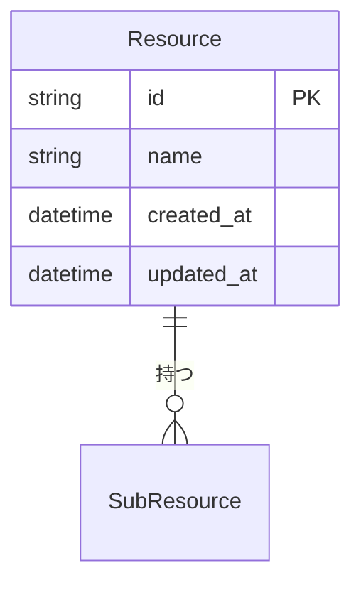
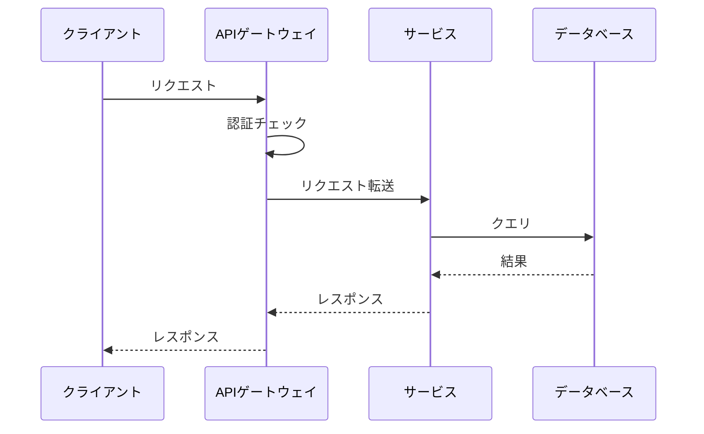

# {API名} - API仕様書

> **バージョン**: 1.0
> **作成日**: {YYYY-MM-DD}
> **作成者**: {作成者}
> **ステータス**: 下書き | レビュー中 | 承認済み
> **ベースURL**: `{base_url}`

## 1. 概要

### 1.1 目的

{このAPIが提供するものとシステム内での役割}

### 1.2 利用者

| 利用者 | 利用用途 |
|:-------|:---------|
| {クライアント/サービス} | {どのように利用するか} |

### 1.3 スコープ

**対象範囲**:
- {含まれるもの}

**対象外**:
- {明示的に除外するもの}

## 2. 認証・認可

| 方式 | 説明 |
|:-----|:-----|
| {例: Bearer Token / APIキー / OAuth 2.0} | {詳細} |

**認可モデル**:
| ロール | 権限 |
|:-------|:-----|
| {ロール} | {許可される操作} |

## 3. 共通仕様

### 3.1 リクエストヘッダー

| ヘッダー | 必須 | 説明 | 例 |
|:---------|:-----|:-----|:---|
| Content-Type | はい | リクエスト形式 | `application/json` |
| Authorization | はい | 認証トークン | `Bearer {token}` |

### 3.2 レスポンス形式

```json
{
  "data": {},
  "meta": {
    "request_id": "string",
    "timestamp": "ISO 8601"
  }
}
```

### 3.3 エラーレスポンス形式

```json
{
  "error": {
    "code": "ERROR_CODE",
    "message": "人が読めるメッセージ",
    "details": []
  }
}
```

### 3.4 共通エラーコード

| HTTPステータス | エラーコード | 説明 |
|:-------------|:-----------|:-----|
| 400 | BAD_REQUEST | リクエストパラメータが不正 |
| 401 | UNAUTHORIZED | 認証が必要 |
| 403 | FORBIDDEN | 権限不足 |
| 404 | NOT_FOUND | リソースが見つからない |
| 429 | RATE_LIMITED | リクエスト数超過 |
| 500 | INTERNAL_ERROR | サーバーエラー |

### 3.5 ページネーション

| パラメータ | 型 | デフォルト | 説明 |
|:----------|:---|:----------|:-----|
| page | integer | 1 | ページ番号 |
| per_page | integer | 20 | ページあたりの件数（最大: 100） |

**ページネーションレスポンス**:
```json
{
  "data": [],
  "pagination": {
    "page": 1,
    "per_page": 20,
    "total": 100,
    "total_pages": 5
  }
}
```

## 4. エンドポイント

### 4.1 エンドポイント一覧

| メソッド | パス | 説明 | 認証 |
|:---------|:-----|:-----|:-----|
| GET | /resources | リソース一覧取得 | 必要 |
| POST | /resources | リソース作成 | 必要 |
| GET | /resources/:id | リソース詳細取得 | 必要 |
| PUT | /resources/:id | リソース更新 | 必要 |
| DELETE | /resources/:id | リソース削除 | 必要 |

### 4.2 エンドポイント詳細

---

#### `GET /resources`

**説明**: {説明}

**クエリパラメータ**:
| パラメータ | 型 | 必須 | 説明 | 例 |
|:----------|:---|:-----|:-----|:---|
| {パラメータ} | {型} | はい/いいえ | {説明} | {例} |

**レスポンス** (`200 OK`):
```json
{
  "data": [
    {
      "id": "string",
      "name": "string",
      "created_at": "2024-01-01T00:00:00Z"
    }
  ],
  "pagination": {}
}
```

**エラーレスポンス**:
| ステータス | コード | 発生条件 |
|:----------|:-------|:---------|
| 401 | UNAUTHORIZED | トークンが未指定または無効 |

---

#### `POST /resources`

**説明**: {説明}

**リクエストボディ**:
```json
{
  "name": "string (必須)",
  "description": "string (任意)"
}
```

**バリデーションルール**:
| フィールド | ルール | エラーコード |
|:----------|:------|:-----------|
| name | 必須、1〜100文字 | VALIDATION_ERROR |

**レスポンス** (`201 Created`):
```json
{
  "data": {
    "id": "string",
    "name": "string",
    "created_at": "2024-01-01T00:00:00Z"
  }
}
```

---

## 5. データモデル

### 5.1 エンティティ関連図



### 5.2 スキーマ定義

#### Resource

| フィールド | 型 | 必須 | 説明 | 制約 |
|:----------|:---|:-----|:-----|:-----|
| id | string (UUID) | はい | 一意な識別子 | 自動生成 |
| name | string | はい | リソース名 | 1〜100文字 |
| created_at | datetime | はい | 作成日時 | ISO 8601 |

## 6. データフロー



## 7. レートリミット

| ティア | 制限 | ウィンドウ |
|:-------|:-----|:---------|
| デフォルト | {N}リクエスト | 1分あたり |
| 認証済み | {N}リクエスト | 1分あたり |

**レートリミットヘッダー**:
| ヘッダー | 説明 |
|:---------|:-----|
| X-RateLimit-Limit | ウィンドウあたりの最大リクエスト数 |
| X-RateLimit-Remaining | 残りリクエスト数 |
| X-RateLimit-Reset | リセット日時（Unixタイムスタンプ） |

## 8. バージョニング戦略

| 項目 | 値 |
|:-----|:---|
| 戦略 | {URLパス / ヘッダー / クエリパラメータ} |
| 現行バージョン | v1 |
| 非推奨化ポリシー | {ポリシー} |

## 付録

### 用語集

| 用語 | 定義 |
|:-----|:-----|
| {用語} | {定義} |

### 変更履歴

| バージョン | 日付 | 変更内容 | 変更者 |
|:-----------|:-----|:---------|:-------|
| 1.0 | {YYYY-MM-DD} | 初版作成 | {作成者} |
