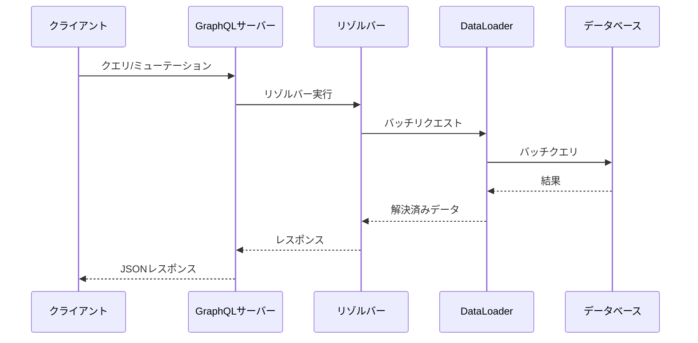

# {API名} - GraphQLスキーマ定義

> **バージョン**: 1.0
> **作成日**: {YYYY-MM-DD}
> **作成者**: {作成者}
> **ステータス**: 下書き | レビュー中 | 承認済み
> **エンドポイント**: `{graphql_endpoint}`

## 1. 概要

{このGraphQL APIが提供するものとシステム内での役割}

## 2. スキーマ

### 2.1 カスタムスカラー

```graphql
"""ISO 8601形式の日時文字列"""
scalar DateTime

"""汎用一意識別子"""
scalar UUID
```

### 2.2 Enum

```graphql
enum SortOrder {
  ASC
  DESC
}

enum ResourceStatus {
  ACTIVE
  INACTIVE
  ARCHIVED
}
```

### 2.3 型定義

```graphql
"""リソースエンティティ"""
type Resource {
  id: UUID!
  name: String!
  status: ResourceStatus!
  createdAt: DateTime!
  updatedAt: DateTime!
  """関連するサブリソース"""
  subResources(first: Int, after: String): SubResourceConnection!
}

type SubResource {
  id: UUID!
  value: String!
  resource: Resource!
}
```

### 2.4 コネクション（ページネーション）

```graphql
type ResourceConnection {
  edges: [ResourceEdge!]!
  pageInfo: PageInfo!
  totalCount: Int!
}

type ResourceEdge {
  node: Resource!
  cursor: String!
}

type PageInfo {
  hasNextPage: Boolean!
  hasPreviousPage: Boolean!
  startCursor: String
  endCursor: String
}
```

### 2.5 入力型

```graphql
input CreateResourceInput {
  name: String!
  status: ResourceStatus = ACTIVE
}

input UpdateResourceInput {
  name: String
  status: ResourceStatus
}

input ResourceFilterInput {
  status: ResourceStatus
  search: String
}
```

## 3. オペレーション

### 3.1 クエリ

```graphql
type Query {
  """IDでリソースを取得"""
  resource(id: UUID!): Resource

  """フィルタリングとページネーション付きでリソース一覧を取得"""
  resources(
    filter: ResourceFilterInput
    first: Int = 20
    after: String
    orderBy: SortOrder = ASC
  ): ResourceConnection!
}
```

### 3.2 ミューテーション

```graphql
type Mutation {
  """リソースを新規作成"""
  createResource(input: CreateResourceInput!): CreateResourcePayload!

  """既存リソースを更新"""
  updateResource(id: UUID!, input: UpdateResourceInput!): UpdateResourcePayload!

  """リソースを削除"""
  deleteResource(id: UUID!): DeleteResourcePayload!
}

type CreateResourcePayload {
  resource: Resource!
}

type UpdateResourcePayload {
  resource: Resource!
}

type DeleteResourcePayload {
  success: Boolean!
}
```

### 3.3 サブスクリプション

```graphql
type Subscription {
  """リソースの変更を購読"""
  resourceChanged(id: UUID): ResourceChangedPayload!
}

type ResourceChangedPayload {
  event: ChangeEvent!
  resource: Resource!
}

enum ChangeEvent {
  CREATED
  UPDATED
  DELETED
}
```

## 4. エラーハンドリング

```graphql
"""アプリケーションレベルのエラー（extensionsに格納）"""
# エラーはGraphQL仕様のエラー形式に従う:
# {
#   "errors": [
#     {
#       "message": "人が読めるメッセージ",
#       "extensions": {
#         "code": "ERROR_CODE",
#         "details": {}
#       }
#     }
#   ]
# }
```

| エラーコード | 説明 | 例 |
|:-----------|:-----|:---|
| NOT_FOUND | リソースが存在しない | 無効なIDで `resource(id: "...")` |
| VALIDATION_ERROR | 入力バリデーション失敗 | 必須フィールドの欠落 |
| UNAUTHORIZED | 認証が必要 | トークンが未指定または無効 |
| FORBIDDEN | 権限不足 | 制限されたリソースへのアクセス |

## 5. 認証

{認証方式と認証情報の渡し方}

| 方式 | ヘッダー | 例 |
|:-----|:---------|:---|
| {方式} | Authorization | `Bearer {token}` |

## 6. データフロー



## 7. リゾルバーノート

| リゾルバー | データソース | 備考 |
|:----------|:-----------|:-----|
| Query.resource | データベース | IDで直接取得 |
| Query.resources | データベース | カーソルベースのページネーション |
| Resource.subResources | DataLoader | N+1問題回避のためバッチ処理 |
| Mutation.createResource | データベース | 入力バリデーション後、作成済みエンティティを返す |

## 付録

### 用語集

| 用語 | 定義 |
|:-----|:-----|
| {用語} | {定義} |

### 変更履歴

| バージョン | 日付 | 変更内容 | 変更者 |
|:-----------|:-----|:---------|:-------|
| 1.0 | {YYYY-MM-DD} | 初版作成 | {作成者} |
