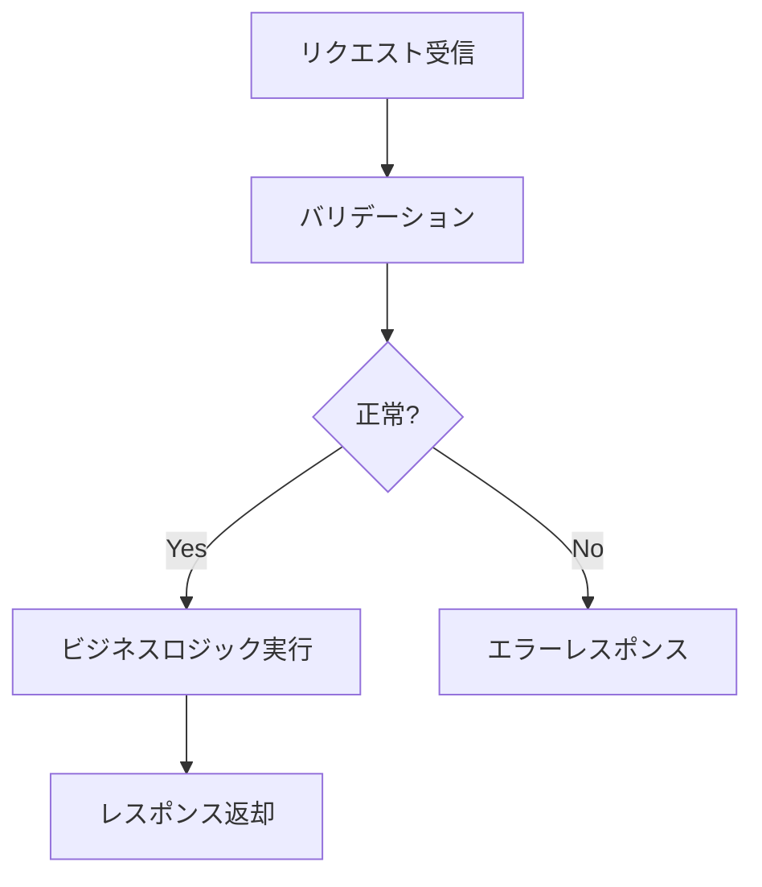

# {機能名} - {ドメイン名}仕様（バックエンド）

> **機能**: [{機能名}](./index.md)
> **ステータス**: 下書き | レビュー中 | 承認済み

## 概要

{このドメインが扱う範囲と目的（1〜2文）}

<!-- 以下、ドメインに応じて必要なセクションを選択する -->
<!-- 不要なセクションは削除、必要なセクションは追加してよい -->

## エンドポイント一覧

| メソッド | パス | 説明 | 認証 |
|:---------|:-----|:-----|:-----|
| {メソッド} | {パス} | {説明} | 必要/不要 |

## エンドポイント詳細

### {メソッド} {パス}

**説明**: {このエンドポイントの目的}

#### リクエスト

**パスパラメータ**:
| パラメータ | 型 | 説明 | 例 |
|:----------|:---|:-----|:---|
| {パラメータ} | {型} | {説明} | {例} |

**クエリパラメータ**:
| パラメータ | 型 | 必須 | デフォルト | 説明 |
|:----------|:---|:-----|:----------|:-----|
| {パラメータ} | {型} | はい/いいえ | {デフォルト} | {説明} |

**リクエストボディ**:
```json
{
  "field": "型 (必須/任意) - 説明"
}
```

**バリデーションルール**:
| フィールド | ルール | エラーコード |
|:----------|:------|:-----------|
| {フィールド} | {ルール} | {コード} |

#### レスポンス

**成功** (`{200/201/204}`):
```json
{
  "data": {}
}
```

**エラー**:
| ステータス | コード | 発生条件 |
|:----------|:-------|:---------|
| 400 | {コード} | {条件} |
| 401 | UNAUTHORIZED | {条件} |
| 404 | NOT_FOUND | {条件} |

---

## 認証・認可

| 項目 | 仕様 |
|:-----|:-----|
| 認証方式 | {Bearer / APIキー / OAuth 2.0} |
| トークン形式 | {JWT / Opaque} |
| 有効期限 | {値} |
| リフレッシュ方式 | {方式} |

**権限モデル**:
| ロール | 許可される操作 |
|:-------|:-------------|
| {ロール} | {操作一覧} |

## ビジネスロジック

{このドメイン固有の処理ルール}

| ID | ルール | 条件 | 振る舞い |
|:---|:-------|:-----|:---------|
| BL-001 | {ルール名} | {条件} | {振る舞い} |

### 処理フロー



## バッチ処理・非同期処理

| 処理名 | トリガー | 実行方式 | リトライ | タイムアウト |
|:-------|:--------|:---------|:---------|:-----------|
| {処理名} | Cron/イベント/手動 | キュー/直接 | {回数・間隔} | {値} |

### キュー仕様

| キュー名 | メッセージ形式 | コンシューマー | DLQ |
|:---------|:-------------|:-------------|:----|
| {キュー名} | {形式} | {処理するサービス} | あり/なし |

## キャッシュ戦略

| キー | データ | TTL | 無効化タイミング |
|:-----|:-------|:----|:---------------|
| {キーパターン} | {キャッシュ対象} | {TTL} | {いつ無効化するか} |

## レートリミット

| エンドポイント | 制限 | ウィンドウ | 超過時の振る舞い |
|:-------------|:-----|:---------|:----------------|
| {パス} | {N}リクエスト | {期間} | {429レスポンス等} |

## 外部サービス連携

| サービス | 用途 | 通信方式 | フォールバック |
|:---------|:-----|:---------|:-------------|
| {サービス名} | {用途} | REST/gRPC/SDK | {サービスダウン時の対応} |

## エラーハンドリング

| エラーケース | 発生条件 | レスポンス | ログレベル | リトライ |
|:------------|:---------|:---------|:----------|:--------|
| {ケース} | {条件} | {ステータス・コード} | ERROR/WARN | あり/なし |

## ログ・監視

| イベント | ログレベル | 含める情報 | アラート |
|:--------|:----------|:----------|:--------|
| {イベント} | INFO/WARN/ERROR | {ログに含めるデータ} | あり/なし |

## パフォーマンス要件

| 指標 | 目標値 | 計測方法 |
|:-----|:-------|:---------|
| レスポンスタイム (P50) | {値} | {方法} |
| レスポンスタイム (P99) | {値} | {方法} |
| スループット | {値} | {方法} |

## 制限事項

- {既知の制限や対応しないケース}

## 関連仕様

- [{関連仕様名}](./{related}-spec.md) - {どう関連するか}
