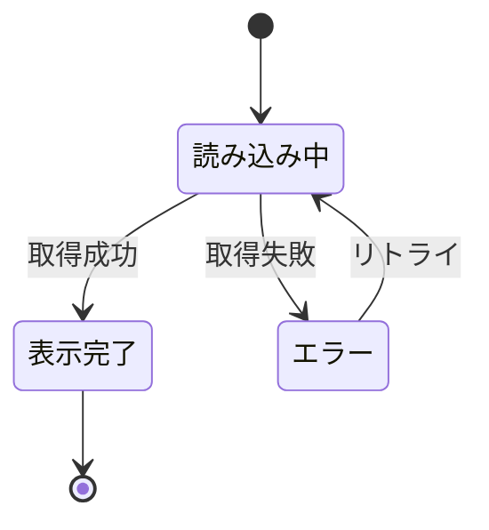

# {機能名} - {ドメイン名}仕様（フロントエンド）

> **機能**: [{機能名}](./index.md)
> **ステータス**: 下書き | レビュー中 | 承認済み

## 概要

{このドメインが扱う範囲と目的（1〜2文）}

<!-- 以下、ドメインに応じて必要なセクションを選択する -->
<!-- 不要なセクションは削除、必要なセクションは追加してよい -->

## ページ構成

| ページ | URL | 説明 |
|:-------|:----|:-----|
| {ページ名} | `{/path}` | {目的} |

## レイアウト

{ページレイアウトの説明またはASCIIワイヤーフレーム}

```
┌─────────────────────────────┐
│         ヘッダー              │
├──────────┬──────────────────┤
│ サイドバー │                  │
│          │   メインコンテンツ  │
│          │                  │
├──────────┴──────────────────┤
│         フッター              │
└─────────────────────────────┘
```

## コンポーネント

| コンポーネント | 種別 | 説明 | 振る舞い |
|:-------------|:-----|:-----|:---------|
| {名前} | ボタン/入力欄/リスト/モーダル/... | {表示内容} | {操作時の動作} |

## ユーザー操作

| 操作 | トリガー | 振る舞い | 遷移先 |
|:-----|:--------|:---------|:-------|
| {操作名} | クリック/入力/スクロール/... | {何が起きるか} | {遷移先（あれば）} |

## フォーム仕様

### フィールド定義

| フィールド | 種別 | 必須 | 初期値 | 説明 |
|:----------|:-----|:-----|:-------|:-----|
| {フィールド} | テキスト/セレクト/チェックボックス/... | はい/いいえ | {初期値} | {説明} |

### バリデーションルール

| フィールド | ルール | エラーメッセージ | タイミング |
|:----------|:------|:---------------|:----------|
| {フィールド} | {ルール} | {メッセージ} | onBlur/onChange/onSubmit |

### 送信時の動作

| アクション | API呼び出し | 成功時 | 失敗時 |
|:----------|:-----------|:-------|:-------|
| {アクション} | {メソッド} {パス} | {動作・遷移先} | {エラー表示} |

## 状態管理

### ページの状態

| 状態名 | 型 | 初期値 | 更新トリガー |
|:-------|:---|:-------|:-----------|
| {状態名} | {型} | {初期値} | {何が起きたら更新されるか} |

### 状態遷移図



## API呼び出し

| タイミング | メソッド | エンドポイント | 用途 | エラー時の振る舞い |
|:----------|:---------|:-------------|:-----|:-----------------|
| マウント時 | GET | {パス} | {用途} | {エラー表示方法} |
| ボタン押下時 | POST | {パス} | {用途} | {エラー表示方法} |

## 表示データ

| フィールド | ソース | フォーマット | 空の場合 |
|:----------|:-------|:------------|:---------|
| {フィールド} | {API レスポンスのパス} | {表示ルール} | {フォールバック表示} |

## エラー表示

| エラーケース | 発生条件 | 表示方法 | ユーザーアクション |
|:------------|:---------|:---------|:----------------|
| {ケース} | {条件} | トースト/インライン/ページ遷移/... | {復旧操作} |

## レスポンシブ対応

| ブレークポイント | レイアウト変更 |
|:---------------|:-------------|
| モバイル（〜767px） | {変更内容} |
| タブレット（768〜1023px） | {変更内容} |
| デスクトップ（1024px〜） | {変更内容} |

## アニメーション・トランジション

| 対象 | トリガー | アニメーション | 時間 |
|:-----|:--------|:-------------|:-----|
| {要素} | {トリガー} | {種類} | {ms} |

## アクセシビリティ

| 観点 | 対応方針 |
|:-----|:---------|
| キーボード操作 | {Tab順序、ショートカット} |
| スクリーンリーダー | {aria属性、role} |
| カラーコントラスト | {WCAG基準} |
| フォーカス管理 | {モーダル、遷移時のフォーカス} |

## パフォーマンス

| 指標 | 目標値 | 対策 |
|:-----|:-------|:-----|
| 初回表示 (LCP) | {値} | {遅延読み込み等} |
| 操作応答 (INP) | {値} | {デバウンス等} |
| バンドルサイズ | {値} | {コード分割等} |

## 制限事項

- {既知の制限や対応しないケース}

## 関連仕様

- [{関連仕様名}](./{related}-spec.md) - {どう関連するか}
