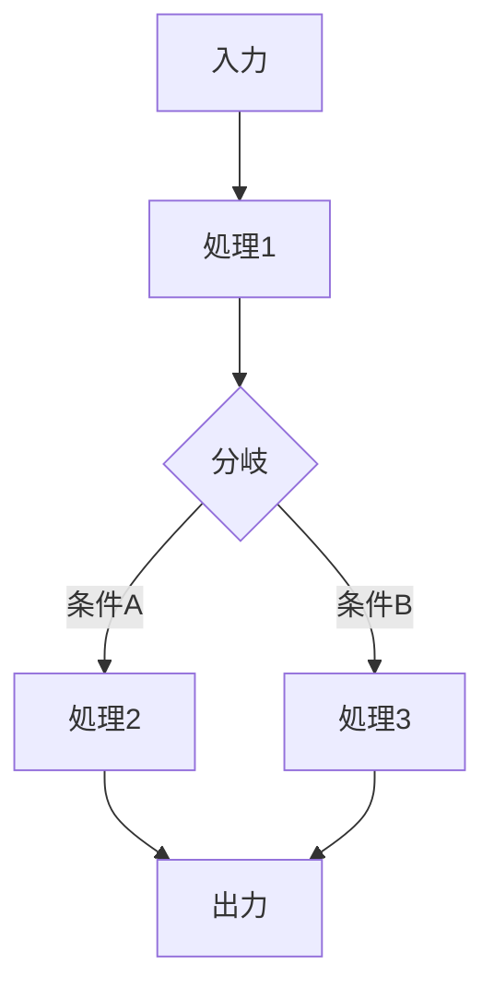

# {機能名}

> **バージョン**: 1.0
> **作成日**: {YYYY-MM-DD}
> **作成者**: {作成者}
> **ステータス**: 下書き | レビュー中 | 承認済み

## 概要

{この機能が何をし、なぜ必要か（2〜3文）}

## 背景

{現状の課題やビジネスコンテキスト}

## スコープ

**対象範囲**:
- {含まれるもの}

**対象外**:
- {明示的に除外するもの}

## ユーザーストーリー

| ID | ～として | ～したい | ～のために | 優先度 |
|:---|:---------|:---------|:-----------|:-------|
| US-001 | {役割} | {行動} | {理由} | 高/中/低 |

## 処理フロー

## 仕様書一覧

| 仕様書 | 説明 |
|:-------|:-----|
| [{domain}-spec.md](./{domain}-spec.md) | {この仕様書が扱う範囲の概要} |

## 非機能要件

| カテゴリ | 要件 | 目標値 |
|:---------|:-----|:-------|
| パフォーマンス | {要件} | {目標値} |

## 用語集

| 用語 | 定義 |
|:-----|:-----|
| {用語} | {定義} |

## 変更履歴

| バージョン | 日付 | 変更内容 | 変更者 |
|:-----------|:-----|:---------|:-------|
| 1.0 | {YYYY-MM-DD} | 初版作成 | {作成者} |
