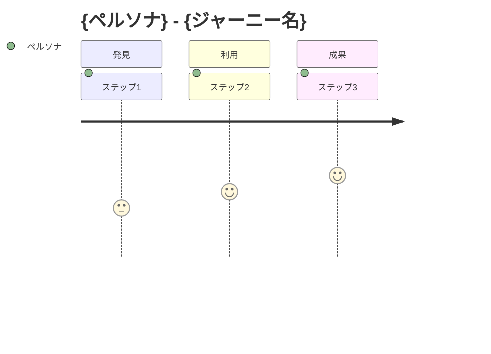
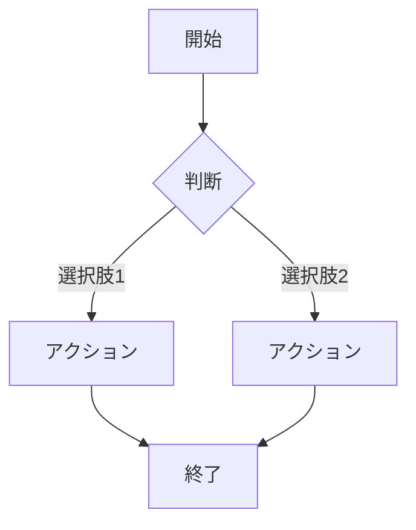

# {プロダクト/機能名} - プロダクト要件定義書（PRD）

> **バージョン**: 1.0
> **作成日**: {YYYY-MM-DD}
> **作成者**: {作成者}
> **ステータス**: 下書き | レビュー中 | 承認済み

## 1. 課題

### 1.1 背景

{現状の状況とコンテキスト}

### 1.2 課題内容

{解決すべき具体的な課題。可能であれば定量的に}

### 1.3 影響

{課題が未解決の場合のビジネスへの影響}

## 2. 目標と成功指標

### 2.1 目標

| 目標 | 説明 |
|:-----|:-----|
| 主目標 | {メインの目標} |
| 副目標 | {サブの目標} |

### 2.2 成功指標（KPI）

| 指標 | 現状 | 目標値 | 計測方法 |
|:-----|:-----|:-------|:---------|
| {指標} | {ベースライン} | {目標値} | {計測方法} |

### 2.3 非目標

- {このプロジェクトで明示的に目指さないこと}

## 3. ユーザーペルソナとジャーニー

### 3.1 ペルソナ

| ペルソナ | 説明 | 主要ニーズ | ペインポイント |
|:---------|:-----|:----------|:-------------|
| {名前} | {どんな人か} | {何を求めているか} | {何に困っているか} |

### 3.2 ユーザージャーニー

## 4. スコープ

### 4.1 対象範囲

| ID | 機能 | 優先度 | 説明 |
|:---|:-----|:-------|:-----|
| F-001 | {機能} | P0/P1/P2 | {説明} |

### 4.2 対象外

- {明示的に除外するものとその理由}

### 4.3 フェーズ分け（該当する場合）

| フェーズ | 機能 | タイムライン |
|:---------|:-----|:-----------|
| MVP | {機能} | {タイムライン} |
| V2 | {機能} | {タイムライン} |

## 5. 提案するソリューション

### 5.1 ソリューション概要

{提案するアプローチの概要}

### 5.2 主要ユーザーフロー

### 5.3 主要な設計判断

| 判断事項 | 検討した選択肢 | 選択 | 理由 |
|:---------|:-------------|:-----|:-----|
| {判断事項} | {選択肢} | {選択した案} | {理由} |

## 6. 機能要件

| ID | 要件 | 優先度 | 受け入れ基準 |
|:---|:-----|:-------|:-----------|
| FR-001 | {説明} | P0/P1/P2 | {基準} |

## 7. 非機能要件

| カテゴリ | 要件 | 目標値 |
|:---------|:-----|:-------|
| パフォーマンス | {要件} | {目標値} |
| セキュリティ | {要件} | {目標値} |
| アクセシビリティ | {要件} | {目標値} |

## 8. 依存関係とリスク

### 8.1 依存関係

| 依存先 | 担当 | 遅延時の影響 |
|:-------|:-----|:-----------|
| {依存先} | {チーム/担当者} | {影響} |

### 8.2 リスクと対策

| リスク | 発生確率 | 影響度 | 対策 |
|:-------|:---------|:-------|:-----|
| {リスク} | 高/中/低 | 高/中/低 | {対策} |

### 8.3 未解決の質問

| 質問 | 担当 | 期限 |
|:-----|:-----|:-----|
| {質問} | {誰が決めるか} | {いつまでに} |

## 9. ローンチ計画（該当する場合）

| 項目 | 計画 |
|:-----|:-----|
| リリース戦略 | {アプローチ} |
| コミュニケーション計画 | {告知方法} |
| ドキュメント | {更新が必要なもの} |
| サポート体制 | {研修/FAQ対応} |

## 付録

### 用語集

| 用語 | 定義 |
|:-----|:-----|
| {用語} | {定義} |

### 参考資料

- {関連ドキュメント、調査資料、リソース}

### 変更履歴

| バージョン | 日付 | 変更内容 | 変更者 |
|:-----------|:-----|:---------|:-------|
| 1.0 | {YYYY-MM-DD} | 初版作成 | {作成者} |
