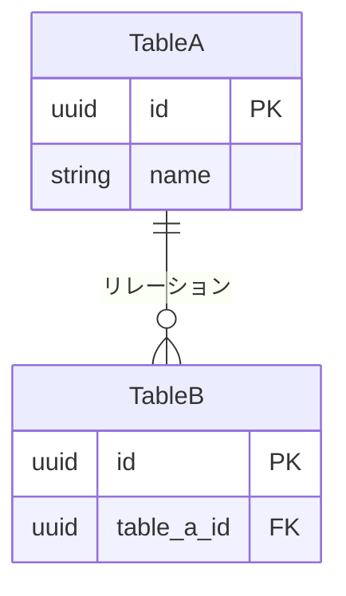

# {機能名} - {テーブル名/ドメイン名}テーブル仕様

> **機能**: [{機能名}](./index.md)
> **ステータス**: 下書き | レビュー中 | 承認済み

## 概要

{このテーブル/データモデルが扱う範囲と目的（1〜2文）}

<!-- 以下、必要なセクションを選択する -->
<!-- 不要なセクションは削除、必要なセクションは追加してよい -->

## テーブル一覧

| テーブル名 | 説明 |
|:----------|:-----|
| {テーブル名} | {目的} |

## スキーマ

### {テーブル名}

| カラム | 型 | NULL許可 | デフォルト | 説明 |
|:-------|:---|:---------|:----------|:-----|
| id | UUID / BIGINT | NO | 自動生成 | 主キー |
| {カラム} | {型} | YES/NO | {デフォルト} | {説明} |
| created_at | TIMESTAMP | NO | NOW() | 作成日時 |
| updated_at | TIMESTAMP | NO | NOW() | 更新日時 |

## 制約

| 制約名 | 種別 | 対象カラム | 説明 |
|:-------|:-----|:----------|:-----|
| pk_{テーブル} | PRIMARY KEY | id | |
| uq_{テーブル}_{カラム} | UNIQUE | {カラム} | {説明} |
| fk_{テーブル}_{参照先} | FOREIGN KEY | {カラム} → {参照テーブル}.{参照カラム} | {説明} |
| ck_{テーブル}_{ルール} | CHECK | {カラム} | {ルール} |

## インデックス

| インデックス名 | 対象カラム | 種別 | 用途 |
|:-------------|:----------|:-----|:-----|
| idx_{テーブル}_{カラム} | {カラム} | BTREE/GIN/GiST/... | {どのクエリをサポートするか} |

## リレーションシップ

| リレーション | テーブル | 種別 | 削除時の動作 |
|:------------|:--------|:-----|:------------|
| {名前} | {関連テーブル} | 1:1 / 1:N / N:M | CASCADE/SET NULL/RESTRICT |

## データライフサイクル

| イベント | トリガー | 動作 | 備考 |
|:--------|:--------|:-----|:-----|
| 作成 | {いつ作成されるか} | {デフォルト値・副作用} | |
| 更新 | {いつ更新されるか} | {更新可能な項目・制約} | |
| 削除 | {論理削除/物理削除} | {カスケード・保持期間} | |

## データ整合性

| ルール | 説明 | 強制方法 |
|:-------|:-----|:---------|
| {ルール名} | {何を保証するか} | DB制約/アプリ層/トリガー |

## マイグレーション

| 変更内容 | 方式 | ロールバック | データ移行 |
|:---------|:-----|:-----------|:----------|
| {変更内容} | {ALTER TABLE等} | {ロールバック方法} | {既存データの扱い} |

## 初期データ・シード

| {主要カラム...} | 説明 |
|:---------------|:-----|
| {値} | {説明} |

## パフォーマンス考慮

| 観点 | 対策 |
|:-----|:-----|
| 想定レコード数 | {規模} |
| 主要クエリパターン | {よく実行されるクエリ} |
| パーティション | {必要な場合の戦略} |

## 制限事項

- {既知の制限や対応しないケース}

## 関連仕様

- [{関連仕様名}](./{related}-spec.md) - {どう関連するか}
