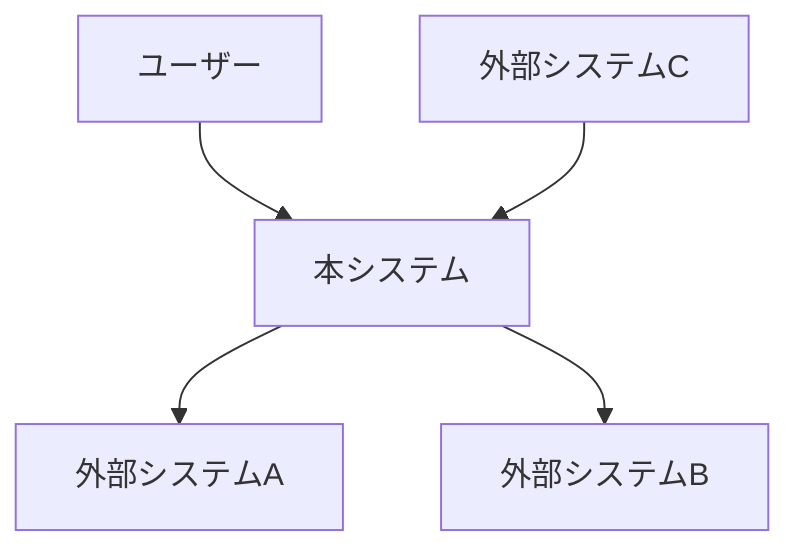
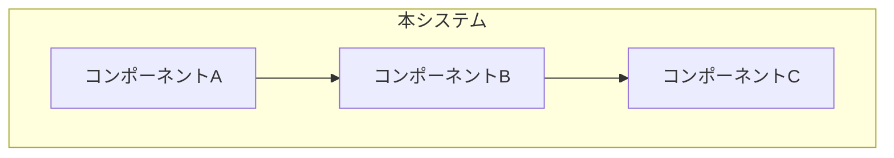
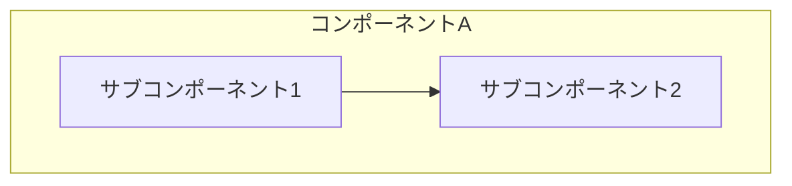
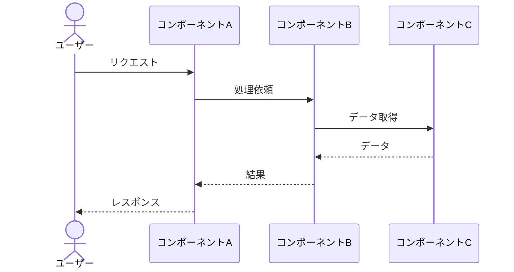
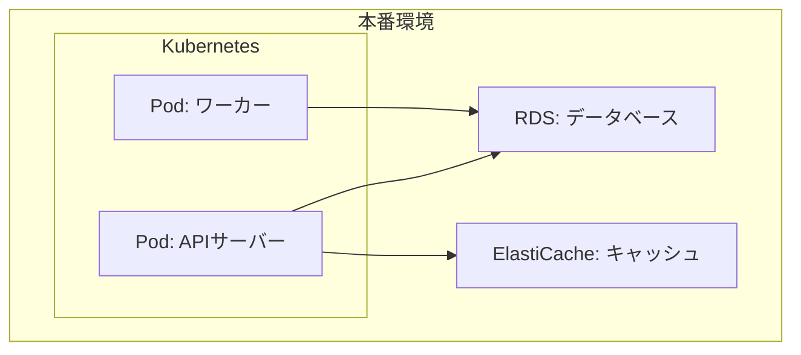

# {システム名} - Arc42 アーキテクチャドキュメント

> **バージョン**: 1.0
> **作成日**: {YYYY-MM-DD}
> **作成者**: {作成者}
> **ステータス**: 下書き | レビュー中 | 承認済み

## 1. イントロダクションと目標

### 1.1 要件概要

{最も重要な機能要件のトップ3〜5}

| ID | 要件 | 優先度 |
|:---|:-----|:-------|
| R-001 | {要件} | 高/中/低 |

### 1.2 品質目標

| 品質属性 | 目標 | 優先度 |
|:---------|:-----|:-------|
| {パフォーマンス/セキュリティ/可用性等} | {具体的な目標} | 1/2/3 |

### 1.3 ステークホルダー

| ステークホルダー | 役割 | 関心事 |
|:---------------|:-----|:-------|
| {名前/役割} | {プロジェクトでの役割} | {アーキテクチャに対する期待} |

## 2. 制約

### 2.1 技術的制約

| 制約 | 背景 |
|:-----|:-----|
| {制約} | {なぜこの制約があるか} |

### 2.2 組織的制約

| 制約 | 背景 |
|:-----|:-----|
| {制約} | {なぜこの制約があるか} |

### 2.3 規約

| 規約 | 説明 |
|:-----|:-----|
| {規約} | {説明} |

## 3. コンテキストとスコープ

### 3.1 ビジネスコンテキスト



| 通信相手 | 入力 | 出力 |
|:---------|:-----|:-----|
| {ユーザー/外部システム} | {受け取るもの} | {送り出すもの} |

### 3.2 技術コンテキスト

| チャネル | プロトコル | データ形式 |
|:---------|:---------|:----------|
| {通信経路} | {REST/gRPC/MQTT等} | {JSON/Protobuf等} |

## 4. ソリューション戦略

| 品質目標 | アプローチ | 詳細 |
|:---------|:----------|:-----|
| {品質目標} | {アーキテクチャアプローチ} | {どう実現するか} |

## 5. ビルディングブロックビュー

### レベル1: 全体構成



| ブロック | 責務 |
|:---------|:-----|
| {コンポーネント} | {責務の説明} |

### レベル2: {コンポーネント名} の内部



| サブブロック | 責務 |
|:------------|:-----|
| {サブコンポーネント} | {責務の説明} |

## 6. ランタイムビュー

### シナリオ: {シナリオ名}



## 7. デプロイメントビュー



| ノード | 仕様 | コンポーネント |
|:-------|:-----|:-------------|
| {ノード} | {スペック} | {デプロイされるコンポーネント} |

## 8. 横断的関心事

### 8.1 セキュリティ

{認証、認可、暗号化、監査の方針}

### 8.2 ログ・監視

{ログフォーマット、監視ツール、アラート方針}

### 8.3 エラーハンドリング

{エラー処理の共通方針}

### 8.4 テスト

{テスト戦略の全体方針}

## 9. アーキテクチャ判断

| ID | 判断 | 根拠 | 日付 |
|:---|:-----|:-----|:-----|
| AD-001 | {判断内容} | {理由とトレードオフ} | {YYYY-MM-DD} |

## 10. 品質要件

### 品質ツリー

```
品質
├── パフォーマンス
│   ├── レスポンスタイム: {目標}
│   └── スループット: {目標}
├── 信頼性
│   ├── 可用性: {目標}
│   └── 障害復旧: {目標}
└── セキュリティ
    ├── 認証: {方式}
    └── データ保護: {方式}
```

### 品質シナリオ

| ID | 品質属性 | シナリオ | 目標値 |
|:---|:---------|:---------|:-------|
| QS-001 | {属性} | {具体的なシナリオ} | {計測可能な目標} |

## 11. リスクと技術的負債

| ID | リスク/負債 | 影響 | 対策 |
|:---|:-----------|:-----|:-----|
| R-001 | {リスクまたは技術的負債} | {影響} | {対策} |

## 12. 用語集

| 用語 | 定義 |
|:-----|:-----|
| {用語} | {定義} |

## 変更履歴

| バージョン | 日付 | 変更内容 | 変更者 |
|:-----------|:-----|:---------|:-------|
| 1.0 | {YYYY-MM-DD} | 初版作成 | {作成者} |
