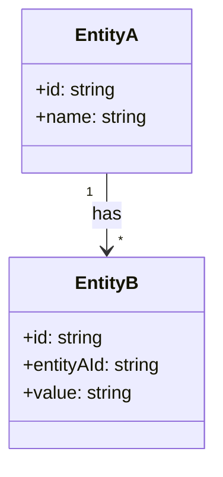
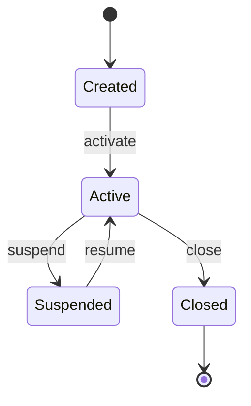

# {機能/システム名} - 設計仕様書

> **バージョン**: 1.0

## 1. 概要

{この設計が扱う対象を1〜2文で。何のための設計か、最終的にどうなるべきかを簡潔に}

## 2. 背景と課題

### 2.1 現状

{今どうなっているか。既存システムの状況、ユーザーが抱えている問題、技術的な負債など}

### 2.2 課題

{なぜこの設計が必要なのか。放置した場合のリスクや影響}

### 2.3 この設計で解決すること

{この設計によって何が解決されるか。ビフォー/アフターで明確に}

## 3. スコープ

### 3.1 対象

- {この設計に含まれるもの}

### 3.2 対象外

<!-- 「やらないこと」を明示することでAIが勝手にスコープを広げるのを防ぐ -->

- {この設計に明示的に含まないもの。やらないこと}

### 3.3 境界条件

<!-- このシステム/機能の境界を明確にする -->

| 境界 | 内側（この設計の責務） | 外側（他の責務） |
|:-----|:--------------------|:---------------|
| {境界の名称} | {この設計が担うこと} | {この設計が担わないこと} |

## 4. 用語定義

<!-- コードで使う変数名・クラス名にも影響するため、ここで統一する -->

| 用語 | 定義 | コード上の表現 |
|:-----|:-----|:-------------|
| {用語} | {意味の定義} | {変数名・クラス名・テーブル名など} |

## 5. 設計判断

<!-- 各判断について「なぜその選択をしたか」「何を捨てたか」を記録する。
     AIが実装時に迷わないために、判断の根拠を明確にしておく -->

### DJ-{NNN}: {判断のタイトル}

- **判断内容**: {何をどうすると決めたか}
- **理由**: {なぜそう決めたか}
- **検討した代替案**:
  - {代替案1}: {概要} → {不採用の理由}
  - {代替案2}: {概要} → {不採用の理由}
- **トレードオフ**: {この判断により受け入れたデメリットや制約}
- **影響範囲**: {この判断が他のどこに影響するか}

<!-- 判断の数だけ繰り返す -->

## 6. ドメインモデル

### 6.1 モデル図

### 6.2 エンティティ定義

#### {エンティティ名}

| 属性 | 型 | 必須 | 説明 | 制約 |
|:-----|:---|:-----|:-----|:-----|
| {属性名} | {型} | Yes/No | {説明} | {値の制約、ユニーク、FK等} |

**不変条件（invariants）**:
- {このエンティティが常に満たすべきルール}

### 6.3 エンティティ間の関係

| 関係 | 多重度 | 説明 | 制約 |
|:-----|:-------|:-----|:-----|
| {EntityA} → {EntityB} | 1:N | {関係の意味} | {カスケード削除の有無等} |

## 7. 振る舞い仕様

<!-- ユースケースや操作ごとに、システムがどう振る舞うべきかを定義する -->

### UC-{NNN}: {ユースケース名}

**トリガー**: {この振る舞いが開始される条件}

**事前条件**:
- {この操作が実行できるために満たすべき条件}

**正常フロー**:
1. {ステップ1}
2. {ステップ2}
3. {ステップ3}

**事後条件**:
- {この操作が完了した後に満たされるべき状態}

**代替フロー**:
- {条件}: {正常フローからの分岐と処理}

**例外フロー**:
- {エラー条件}: {エラー時の処理}

<!-- ユースケースの数だけ繰り返す -->

## 8. 状態遷移

<!-- 状態を持つエンティティがある場合 -->

### {エンティティ名}の状態

| 遷移 | 開始状態 | 終了状態 | トリガー | ガード条件 | アクション |
|:-----|:---------|:---------|:---------|:----------|:----------|
| {遷移名} | {開始} | {終了} | {何がきっかけか} | {遷移が許可される条件} | {遷移時に実行する処理} |

**不正な遷移**:
- {許可されない状態遷移とその理由}

## 9. データフロー

### 9.1 全体のデータフロー

### 9.2 データ変換ルール

| 入力 | 変換処理 | 出力 | バリデーション |
|:-----|:---------|:-----|:-------------|
| {入力データの形式} | {変換の内容} | {出力データの形式} | {入力に対する検証ルール} |

## 10. エラー・例外設計

<!-- 起こりうるエラーを網羅的に列挙し、それぞれの対処方針を決める -->

| ID | エラー | 発生条件 | 深刻度 | 対処方針 | ユーザーへの影響 |
|:---|:-------|:---------|:-------|:---------|:---------------|
| E-{NNN} | {エラー名} | {どんな時に発生するか} | Critical/High/Medium/Low | {リトライ/フォールバック/エラー返却等} | {ユーザーに見える影響} |

### リトライ方針

| 対象 | リトライ回数 | バックオフ | タイムアウト |
|:-----|:-----------|:----------|:-----------|
| {対象操作} | {回数} | {固定/指数} | {秒数} |

## 11. 非機能要件

### 11.1 パフォーマンス

| 指標 | 目標値 | 根拠 |
|:-----|:-------|:-----|
| {レスポンスタイム/スループット等} | {値} | {なぜこの値か} |

### 11.2 セキュリティ

| 観点 | 要件 |
|:-----|:-----|
| 認証 | {方式と要件} |
| 認可 | {方式と要件} |
| データ保護 | {暗号化、マスキング等} |
| 入力バリデーション | {方針} |

### 11.3 可用性・信頼性

| 指標 | 目標値 |
|:-----|:-------|
| {稼働率/MTTR/RPO/RTO等} | {値} |

## 12. 制約条件

<!-- 設計に影響を与える技術的・ビジネス的な制約 -->

| 制約 | 内容 | 影響する設計判断 |
|:-----|:-----|:---------------|
| {制約名} | {内容} | DJ-{NNN} |

## 13. 未決事項

<!-- 実装前に解決すべき未決事項。これが残っている限り実装に着手すべきでない -->

| ID | 未決事項 | 影響範囲 | 期限 | 暫定方針 |
|:---|:---------|:---------|:-----|:---------|
| TBD-{NNN} | {未決の内容} | {影響するセクション/設計判断} | {いつまでに決めるか} | {暫定的にどう進めるか} |

## 14. 参考資料

- {関連する既存コードのパス}
- {関連ドキュメント}
- {外部リソース}
