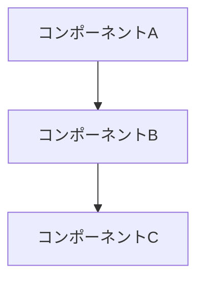

# RFC-{NNN}: {タイトル}

> **バージョン**: 1.0

## 概要

{この RFC が提案する変更の1段落での要約}

## 動機

### 現状

{現在のアプローチやシステムの状態}

### 問題点

{現状の具体的な問題点。可能であれば定量的に}

## 提案

### 詳細設計

{提案するソリューションの詳細}

### アーキテクチャ



### API/インターフェースの変更

{新規/変更されるAPI、データ構造、設定等}

```json
{
  "example": "新しいAPIのリクエスト/レスポンス例"
}
```

## 代替案

### 案A: {代替案名}

- **概要**: {説明}
- **メリット**: {利点}
- **デメリット**: {欠点}
- **不採用理由**: {なぜこの案を選ばなかったか}

### 案B: {代替案名}

- **概要**: {説明}
- **メリット**: {利点}
- **デメリット**: {欠点}
- **不採用理由**: {なぜこの案を選ばなかったか}

## トレードオフ

| 観点 | 提案 | 代替案A | 代替案B |
|:-----|:-----|:--------|:--------|
| 複雑さ | {評価} | {評価} | {評価} |
| パフォーマンス | {評価} | {評価} | {評価} |
| 保守性 | {評価} | {評価} | {評価} |
| 実装コスト | {評価} | {評価} | {評価} |

## 影響範囲

### コンポーネント

| コンポーネント | 変更内容 | 影響度 |
|:-------------|:---------|:-------|
| {コンポーネント} | {変更内容} | 高/中/低 |

### 後方互換性

{既存のクライアント、API利用者、データへの影響}

### マイグレーション

{必要な移行手順}

## セキュリティへの影響

{セキュリティ面での考慮事項。該当なしの場合もその旨記載}

## パフォーマンスへの影響

{パフォーマンス面での考慮事項。ベンチマーク結果があれば記載}

## 実装計画

| フェーズ | 内容 |
|:---------|:-----|
| {フェーズ} | {内容} |

## 参考資料

- {関連RFC、ドキュメント、ブログ記事、論文}

