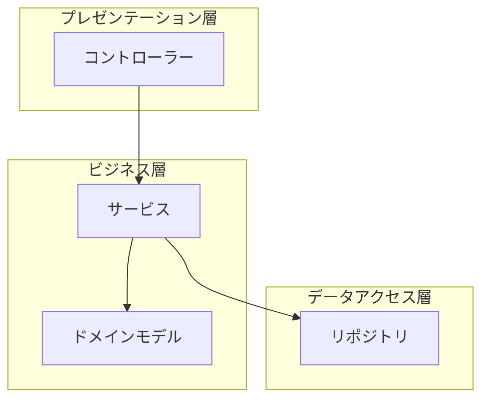
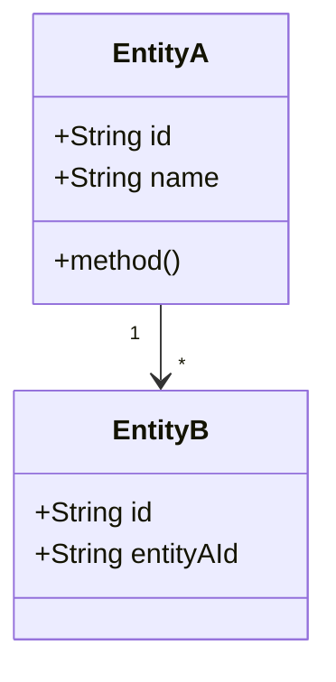
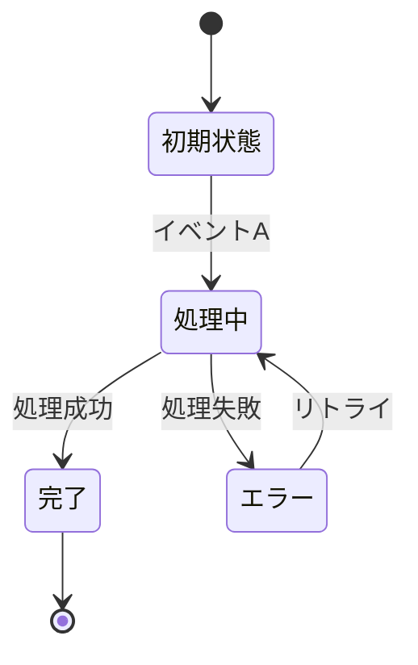
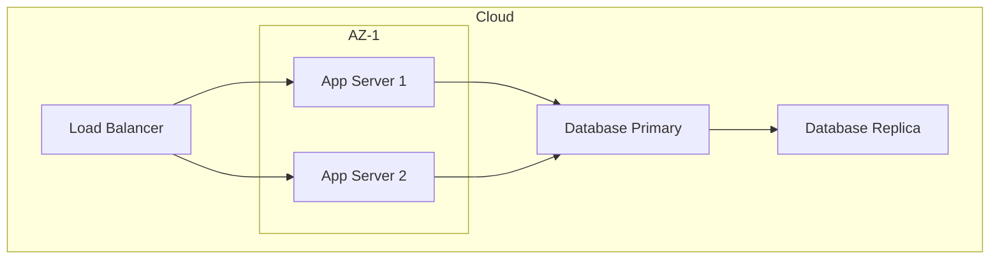

# {ソフトウェア名} - ソフトウェア設計記述（SDD）

> **バージョン**: 1.0
> **作成日**: {YYYY-MM-DD}
> **作成者**: {作成者}
> **ステータス**: 下書き | レビュー中 | 承認済み
> **準拠規格**: IEEE 1016 / ISO/IEC/IEEE 42010

## 1. はじめに

### 1.1 目的

{この設計記述の目的と対象読者}

### 1.2 スコープ

{対象となるソフトウェアの範囲}

### 1.3 参照ドキュメント

| ドキュメント | バージョン | 関係 |
|:------------|:----------|:-----|
| {SRS等} | {バージョン} | {この設計が実現する要件} |

### 1.4 用語定義

| 用語 | 定義 |
|:-----|:-----|
| {用語} | {定義} |

## 2. 設計の関心事（ビューポイント）

{この設計記述で採用するビューポイントの一覧}

| ビューポイント | 目的 | ステークホルダー |
|:-------------|:-----|:----------------|
| 論理ビュー | モジュール構成・責務分割 | 開発者、アーキテクト |
| プロセスビュー | 並行性・スレッドモデル | 開発者、運用 |
| 物理ビュー | デプロイ構成・ノード配置 | インフラ、運用 |
| 開発ビュー | パッケージ・ビルド構成 | 開発者 |

## 3. 論理ビュー

### 3.1 モジュール構成



### 3.2 モジュール定義

| モジュール | 責務 | インターフェース | 依存先 |
|:----------|:-----|:---------------|:-------|
| {モジュール} | {責務} | {公開インターフェース} | {依存するモジュール} |

### 3.3 クラス/型設計



## 4. プロセスビュー

### 4.1 並行性モデル

| プロセス/スレッド | 役割 | 多重度 |
|:----------------|:-----|:-------|
| {プロセス} | {役割} | {インスタンス数} |

### 4.2 同期・排他制御

| リソース | 制御方式 | 粒度 |
|:---------|:---------|:-----|
| {共有リソース} | {ロック/楽観的同時実行制御/キュー等} | {レコード/テーブル等} |

### 4.3 状態遷移



## 5. 物理ビュー

### 5.1 デプロイ構成



### 5.2 ノード定義

| ノード | 仕様 | コンポーネント | 多重度 |
|:-------|:-----|:-------------|:-------|
| {ノード} | {CPU/メモリ/ストレージ} | {配置するコンポーネント} | {台数} |

## 6. 開発ビュー

### 6.1 パッケージ構成

```
src/
├── presentation/    # コントローラー、ミドルウェア
├── application/     # ユースケース、サービス
├── domain/          # エンティティ、値オブジェクト、リポジトリIF
└── infrastructure/  # DB実装、外部サービスクライアント
```

### 6.2 ビルド・依存関係

| 依存 | バージョン | 用途 |
|:-----|:----------|:-----|
| {ライブラリ} | {バージョン} | {用途} |

## 7. 設計根拠

| ID | 設計判断 | 検討した選択肢 | 選択した案 | 根拠 |
|:---|:---------|:-------------|:----------|:-----|
| DR-001 | {判断事項} | {選択肢A, B, C} | {選択した案} | {選択の理由} |

## 8. 要件トレーサビリティ

| 要件ID | 設計要素 | 実現方法 |
|:-------|:---------|:---------|
| {FR-001等} | {モジュール/クラス} | {どう実現するか} |

## 9. 制限事項

- {既知の設計上の制限}

## 変更履歴

| バージョン | 日付 | 変更内容 | 変更者 |
|:-----------|:-----|:---------|:-------|
| 1.0 | {YYYY-MM-DD} | 初版作成 | {作成者} |
