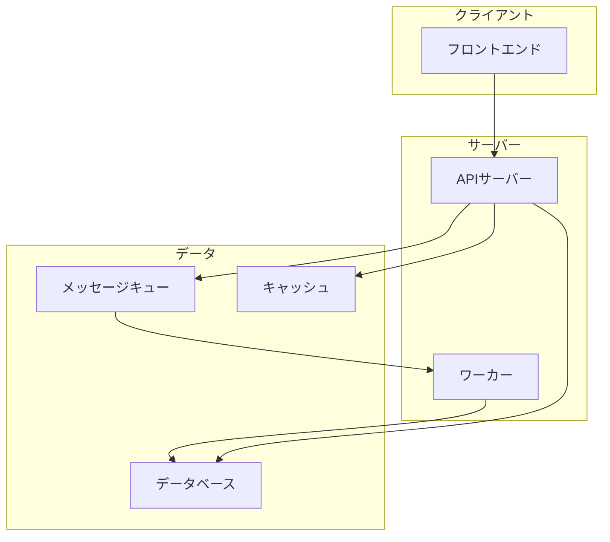
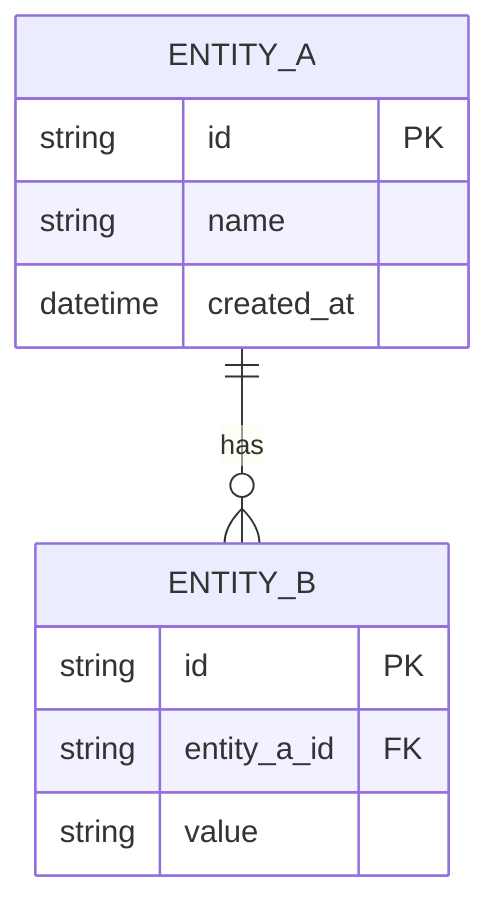
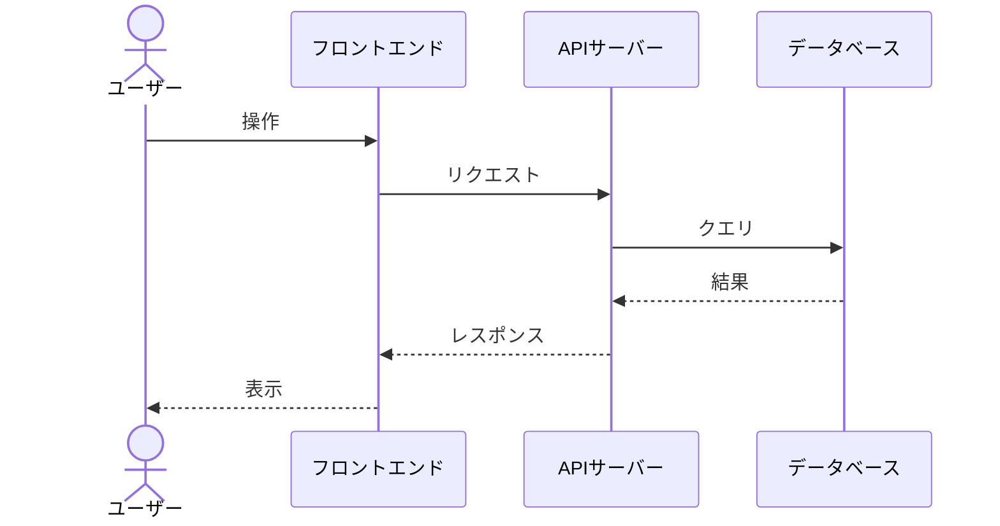

# {機能/システム名} - テクニカルデザインドキュメント

> **バージョン**: 1.0

## 1. 概要

### 1.1 目的

{この設計が解決する技術的課題}

### 1.2 背景

{技術的な背景とコンテキスト}

### 1.3 スコープ

**対象**: {含まれるもの}
**対象外**: {含まれないもの}

## 2. 技術スタック

| レイヤー | 技術 | バージョン | 選定理由 |
|:---------|:-----|:----------|:---------|
| 言語 | {言語} | {バージョン} | {理由} |
| フレームワーク | {FW} | {バージョン} | {理由} |
| データベース | {DB} | {バージョン} | {理由} |
| インフラ | {インフラ} | - | {理由} |

## 3. アーキテクチャ

### 3.1 全体構成



### 3.2 コンポーネント

| コンポーネント | 責務 | 依存先 |
|:-------------|:-----|:-------|
| {コンポーネント} | {責務} | {依存するコンポーネント} |

## 4. データモデル

### 4.1 ER図



### 4.2 エンティティ定義

#### {エンティティ名}

| カラム | 型 | 制約 | 説明 |
|:-------|:---|:-----|:-----|
| {カラム} | {型} | PK/FK/NOT NULL/UNIQUE | {説明} |

## 5. API設計

### 5.1 エンドポイント一覧

| メソッド | パス | 説明 | 認証 |
|:---------|:-----|:-----|:-----|
| {メソッド} | {パス} | {説明} | 必要/不要 |

### 5.2 詳細

#### {メソッド} {パス}

**リクエスト**:
```json
{
  "field": "型 - 説明"
}
```

**レスポンス**:
```json
{
  "data": {}
}
```

## 6. シーケンス図

### {処理名}



## 7. エラーハンドリング

| エラーケース | 発生条件 | 処理 | ユーザーへの通知 |
|:------------|:---------|:-----|:---------------|
| {ケース} | {条件} | {処理内容} | {通知方法} |

## 8. セキュリティ

| 観点 | 対策 |
|:-----|:-----|
| 認証 | {方式} |
| 認可 | {方式} |
| 入力バリデーション | {方針} |
| データ暗号化 | {方式} |

## 9. パフォーマンス

| 指標 | 目標値 | 対策 |
|:-----|:-------|:-----|
| レスポンスタイム | {値} | {対策} |
| スループット | {値} | {対策} |
| メモリ使用量 | {値} | {対策} |

## 10. 監視・ログ

| イベント | ログレベル | 含める情報 | アラート |
|:--------|:----------|:----------|:--------|
| {イベント} | INFO/WARN/ERROR | {情報} | あり/なし |

## 11. テスト戦略

| レベル | 対象 | ツール | カバレッジ目標 |
|:-------|:-----|:-------|:-------------|
| 単体テスト | {対象} | {ツール} | {目標} |
| 結合テスト | {対象} | {ツール} | {目標} |
| E2Eテスト | {対象} | {ツール} | {目標} |

## 12. 制限事項・技術的負債

- {既知の制限や意図的に残す技術的負債}

