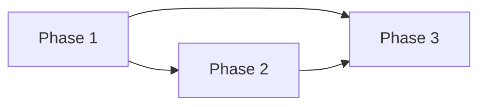

# {機能/プロジェクト名} - AI実装仕様書

> **バージョン**: 1.0
> **作成日**: {YYYY-MM-DD}
> **作成者**: {作成者}
> **ステータス**: 下書き | レビュー中 | 承認済み

## 概要

{何を実装するか。最終的な完成状態を1〜2文で}

## 技術コンテキスト

| 項目 | 値 |
|:-----|:---|
| 言語/バージョン | {言語 バージョン} |
| フレームワーク | {フレームワーク バージョン} |
| データベース | {DB} |
| テストツール | {テストフレームワーク} |
| パッケージマネージャー | {npm/yarn/pip等} |
| ビルドコマンド | `{コマンド}` |
| テストコマンド | `{コマンド}` |
| リントコマンド | `{コマンド}` |

## 変更禁止事項

<!-- AIエージェントが変更してはいけない領域を明示する -->

- {変更禁止のファイル、ディレクトリ、アーキテクチャパターン}

## 実装フェーズ

### Phase 1: {フェーズ名}

**目標**: {このフェーズで達成すること}

**成果物**:
- {作成/変更するファイル}

**依存**: なし（最初のフェーズ）

**実装内容**:

{具体的に何を実装するか}

**受入基準**:

| # | GIVEN（前提） | WHEN（操作） | THEN（期待結果） |
|:--|:-------------|:------------|:----------------|
| 1 | {前提条件} | {操作} | {期待結果} |
| 2 | {前提条件} | {操作} | {期待結果} |

**テスト**:
```
{このフェーズの完了を確認するテストコマンドまたはテスト内容}
```

---

### Phase 2: {フェーズ名}

**目標**: {このフェーズで達成すること}

**成果物**:
- {作成/変更するファイル}

**依存**: Phase 1

**実装内容**:

{具体的に何を実装するか}

**受入基準**:

| # | GIVEN（前提） | WHEN（操作） | THEN（期待結果） |
|:--|:-------------|:------------|:----------------|
| 1 | {前提条件} | {操作} | {期待結果} |

**テスト**:
```
{テストコマンドまたはテスト内容}
```

---

### Phase 3: {フェーズ名}

**目標**: {このフェーズで達成すること}

**成果物**:
- {作成/変更するファイル}

**依存**: Phase 1, Phase 2

**実装内容**:

{具体的に何を実装するか}

**受入基準**:

| # | GIVEN（前提） | WHEN（操作） | THEN（期待結果） |
|:--|:-------------|:------------|:----------------|
| 1 | {前提条件} | {操作} | {期待結果} |

**テスト**:
```
{テストコマンドまたはテスト内容}
```

<!-- フェーズの数だけ繰り返す -->

## フェーズ依存関係



## エッジケース・エラーケース

| ケース | 期待する動作 | 対象フェーズ |
|:-------|:------------|:-----------|
| {ケース} | {動作} | Phase {N} |

## パフォーマンス要件

| 指標 | 目標値 | 計測方法 |
|:-----|:-------|:---------|
| {指標} | {値} | {方法} |

## 参考資料

- {既存コードのパス、ドキュメント、外部リソース}

## 変更履歴

| バージョン | 日付 | 変更内容 | 変更者 |
|:-----------|:-----|:---------|:-------|
| 1.0 | {YYYY-MM-DD} | 初版作成 | {作成者} |
