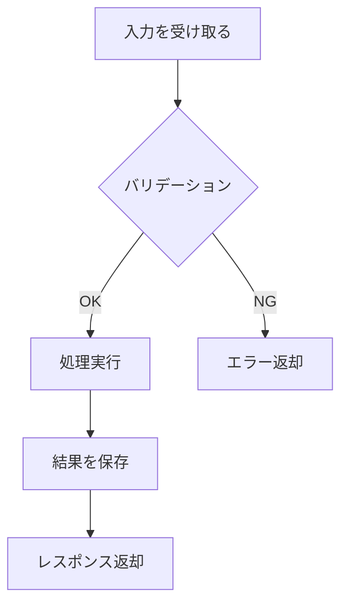

# {機能/プロジェクト名} - 実装仕様書

> **バージョン**: 1.0

## 1. 設計コンテキスト

<!-- 設計仕様書の要約。実装者がこのドキュメントだけで設計意図を理解できるようにする -->

### 1.1 何を作るか

{1〜3文で完成状態を説明}

### 1.2 なぜこう作るか

<!-- 設計判断のダイジェスト。実装中に「なぜ？」と思ったときの参照先 -->

| 判断 | 採用した方針 | 理由（要約） |
|:-----|:-----------|:-----------|
| {判断のタイトル} | {選択した方針} | {1文で理由} |

### 1.3 やらないこと

<!-- AIが勝手にスコープを広げないための歯止め -->

- {この実装で明示的にやらないこと}

### 1.4 関連ドキュメント

- 設計仕様書: `{パス}`
- {その他の関連ドキュメント}

## 2. 技術コンテキスト

| 項目 | 値 |
|:-----|:---|
| 言語/バージョン | {言語 バージョン} |
| フレームワーク | {フレームワーク バージョン} |
| データベース | {DB} |
| テストツール | {テストフレームワーク} |
| パッケージマネージャー | {npm/yarn/pip等} |
| ビルドコマンド | `{コマンド}` |
| テストコマンド | `{コマンド}` |
| リントコマンド | `{コマンド}` |

## 3. 変更禁止事項

<!-- AIエージェントが変更してはいけない領域。ここに書かれたものには絶対に手を出さない -->

- {変更禁止のファイル、ディレクトリ、アーキテクチャパターン、命名規則}

## 4. ファイル構成

<!-- 作成・変更するファイルの全体像。既存ファイルの変更か新規作成かを明示する -->

```
{ディレクトリ構成}
src/
├── feature/
│   ├── index.ts          # [新規] エントリポイント
│   ├── types.ts          # [新規] 型定義
│   ├── handler.ts        # [新規] リクエストハンドラ
│   └── repository.ts     # [新規] データアクセス層
├── shared/
│   └── errors.ts         # [変更] エラー型を追加
└── tests/
    └── feature/
        ├── handler.test.ts     # [新規]
        └── repository.test.ts  # [新規]
```

| ファイル | 操作 | 責務 |
|:---------|:-----|:-----|
| `{パス}` | 新規/変更 | {このファイルが何を担うか} |

## 5. インターフェース定義

<!-- 公開するインターフェース（型、関数シグネチャ、API）を厳密に定義する -->

### 5.1 型定義

```typescript
// {型の用途}
type {TypeName} = {
  {field}: {type}; // {説明}
};
```

### 5.2 関数シグネチャ

```typescript
/**
 * {関数の目的を1文で}
 */
function {functionName}({param}: {Type}): {ReturnType};
```

| 関数 | 引数 | 戻り値 | 副作用 | エラー |
|:-----|:-----|:-------|:-------|:-------|
| `{functionName}` | `{param}: {Type}` | `{ReturnType}` | {DB書き込み等} | {throwする例外} |

### 5.3 APIエンドポイント

<!-- API がある場合 -->

#### {メソッド} {パス}

**リクエスト**:
```json
{
  "{field}": "{型} - {説明}"
}
```

**レスポンス（成功）**:
```json
{
  "{field}": "{値の例}"
}
```

**レスポンス（エラー）**:
| ステータス | 条件 | レスポンス |
|:----------|:-----|:----------|
| {コード} | {発生条件} | `{エラーレスポンス}` |

## 6. データ構造

### 6.1 データベーススキーマ

<!-- テーブル/コレクションの定義 -->

#### {テーブル名}

| カラム | 型 | 制約 | デフォルト | 説明 |
|:-------|:---|:-----|:----------|:-----|
| {カラム名} | {型} | PK/FK/NOT NULL/UNIQUE | {デフォルト値} | {説明} |

**インデックス**:
| インデックス名 | カラム | 種別 | 用途 |
|:-------------|:-------|:-----|:-----|
| {名前} | {カラム} | UNIQUE/BTREE/GIN等 | {このインデックスが必要な理由} |

**マイグレーション**:
```sql
-- {マイグレーションの内容を記述}
```

### 6.2 内部データ構造

<!-- メモリ上のデータ構造、キャッシュ構造など -->

```typescript
// {何のためのデータ構造か}
type {StructureName} = {
  {field}: {type};
};
```

## 7. 処理フロー

<!-- 各処理を、AIがそのままコードに落とせるレベルで記述する -->

### 7.1 {処理名}



**ステップ詳細**:

1. **入力を受け取る**
   - {入力の取得方法}
   - {入力の形式}
2. **バリデーション**
   - {検証ルール1}: {条件} → {NG時のエラー}
   - {検証ルール2}: {条件} → {NG時のエラー}
3. **処理実行**
   - {具体的な処理内容}
   - {呼び出すメソッド/関数}
   - {計算ロジック}
4. **結果を保存**
   - {保存先}
   - {トランザクション要件}
5. **レスポンス返却**
   - {正常時の返却内容}

<!-- 処理の数だけ繰り返す -->

## 8. エラーハンドリング

<!-- 各エラーの具体的な処理方法を定義する -->

| エラー | 発生箇所 | 検知方法 | 処理 | ログ | ユーザーへのメッセージ |
|:-------|:---------|:---------|:-----|:-----|:-------------------|
| {エラー名} | {関数/メソッド} | {try-catch/条件分岐等} | {リトライ/フォールバック/エラー返却} | {ログレベルと内容} | {エラーメッセージ} |

## 9. 実装パターン・規約

<!-- この実装で従うべきパターンやコーディング規約 -->

### 9.1 採用パターン

| パターン | 適用箇所 | 理由 |
|:---------|:---------|:-----|
| {パターン名} | {どこに適用するか} | {なぜこのパターンを使うか} |

### 9.2 命名規約

| 対象 | 規約 | 例 |
|:-----|:-----|:---|
| {ファイル名/変数名/関数名等} | {命名ルール} | {具体例} |

### 9.3 コード例

<!-- 実装の方向性を示すコードスニペット（そのまま使える必要はないが、意図を示す） -->

```typescript
// {何の実装例か}
{コード例}
```

## 10. テスト要件

### 10.1 テストケース

| ID | テスト対象 | テスト内容 | 入力 | 期待結果 |
|:---|:----------|:----------|:-----|:---------|
| T-{NNN} | {関数/エンドポイント} | {何をテストするか} | {入力データ} | {期待される出力/状態} |

### 10.2 テストデータ

```typescript
// テスト用フィクスチャ
const {fixtureName} = {
  {テストデータ}
};
```

### 10.3 テスト実行

```bash
# 全テスト
{テスト実行コマンド}

# 特定テスト
{特定テスト実行コマンド}
```

## 11. 受入基準

| # | GIVEN（前提） | WHEN（操作） | THEN（期待結果） |
|:--|:-------------|:------------|:----------------|
| 1 | {前提条件} | {操作} | {期待結果} |
| 2 | {前提条件} | {操作} | {期待結果} |

## 12. エッジケース

| ケース | 入力/状況 | 期待する動作 | テストID |
|:-------|:---------|:-----------|:--------|
| {ケース名} | {具体的な入力や状況} | {システムの動作} | T-{NNN} |

## 13. パフォーマンス要件

| 指標 | 目標値 | 計測方法 |
|:-----|:-------|:---------|
| {指標} | {値} | {方法} |

## 14. 参考資料

- {既存コードのパス}
- {参考にすべき既存実装}
- {外部リソース}
