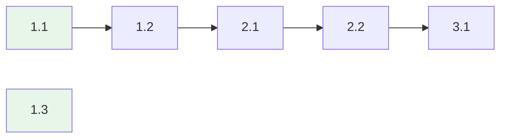

# {機能/プロジェクト名} - タスクリスト

> **作成日**: {YYYY-MM-DD}
> **参照仕様書**: {仕様書へのパス}
> **参照実装計画**: {実装計画へのパス}

## タスク一覧

### Phase 1: {フェーズ名}

| # | タスク | 依存 | 並列 | 完了基準 | 状態 |
|:--|:-------|:-----|:-----|:---------|:-----|
| 1.1 | {タスク内容} | なし | [P] | {完了基準} | [ ] |
| 1.2 | {タスク内容} | 1.1 | | {完了基準} | [ ] |
| 1.3 | {タスク内容} | なし | [P] | {完了基準} | [ ] |

### Phase 2: {フェーズ名}

| # | タスク | 依存 | 並列 | 完了基準 | 状態 |
|:--|:-------|:-----|:-----|:---------|:-----|
| 2.1 | {タスク内容} | 1.2 | | {完了基準} | [ ] |
| 2.2 | {タスク内容} | 2.1 | | {完了基準} | [ ] |

### Phase 3: {フェーズ名}

| # | タスク | 依存 | 並列 | 完了基準 | 状態 |
|:--|:-------|:-----|:-----|:---------|:-----|
| 3.1 | {タスク内容} | 2.2 | | {完了基準} | [ ] |

<!-- [P] = 他タスクと並列実行可能 -->

## 依存関係図

## タスク詳細

### タスク 1.1: {タスク名}

**概要**: {何をするか}

**対象ファイル**:
- `{パス}` - {変更内容}

**完了基準**:
- [ ] {具体的な完了基準}

**注意事項**:
- {実装時の注意点}

<!-- タスクの数だけ繰り返す -->

## 進捗サマリー

| フェーズ | 総タスク | 完了 | 残り |
|:---------|:--------|:-----|:-----|
| Phase 1 | {N} | {N} | {N} |
| Phase 2 | {N} | {N} | {N} |
| Phase 3 | {N} | {N} | {N} |
| **合計** | **{N}** | **{N}** | **{N}** |
