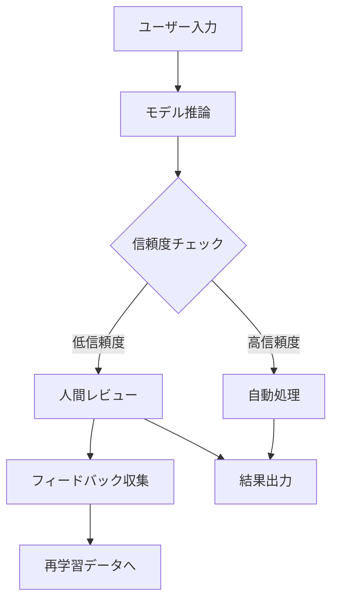

# {プロダクト名} - AI/ML プロダクト要件定義書

> **バージョン**: 1.0
> **作成日**: {YYYY-MM-DD}
> **作成者**: {作成者}
> **ステータス**: 下書き | レビュー中 | 承認済み

## 1. 課題と背景

### 1.1 背景

{現状の状況とコンテキスト}

### 1.2 課題

{AI/MLで解決すべき課題。可能であれば定量的に}

### 1.3 なぜAI/MLか

{従来のルールベースではなくAI/MLが必要な理由}

## 2. 目標と成功指標

### 2.1 目標

| 目標 | 説明 |
|:-----|:-----|
| 主目標 | {メインの目標} |
| 副目標 | {サブの目標} |

### 2.2 成功指標（KPI）

| 指標 | 現状 | 目標値 | 計測方法 |
|:-----|:-----|:-------|:---------|
| {ビジネス指標} | {ベースライン} | {目標値} | {計測方法} |
| {モデル精度指標} | {ベースライン} | {目標値} | {計測方法} |

### 2.3 非目標

- {このプロジェクトで明示的に目指さないこと}

## 3. ユーザーとユースケース

### 3.1 対象ユーザー

| ペルソナ | 説明 | 主要ニーズ |
|:---------|:-----|:----------|
| {ペルソナ} | {説明} | {ニーズ} |

### 3.2 ユースケース

| ID | ユースケース | 入力 | 期待する出力 | 優先度 |
|:---|:------------|:-----|:------------|:-------|
| UC-001 | {ユースケース} | {入力データ} | {期待する出力} | P0/P1/P2 |

## 4. モデル要件

### 4.1 モデル概要

| 項目 | 仕様 |
|:-----|:-----|
| タスク種別 | 分類 / 生成 / 推薦 / 検索 / 要約 / その他 |
| モデルタイプ | {LLM / CNN / Transformer / etc.} |
| 入力形式 | {テキスト / 画像 / 音声 / 構造化データ} |
| 出力形式 | {テキスト / ラベル / スコア / 埋め込みベクトル} |

### 4.2 パフォーマンス要件

| 指標 | 目標値 | 最低許容値 |
|:-----|:-------|:----------|
| 精度（Accuracy / F1 / BLEU等） | {値} | {値} |
| レイテンシ（P50） | {値} | {値} |
| レイテンシ（P99） | {値} | {値} |
| スループット | {値} | {値} |

### 4.3 学習データ

| 項目 | 仕様 |
|:-----|:-----|
| データソース | {ソース} |
| データ量 | {量} |
| ラベリング方法 | {人手 / 自動 / 半自動} |
| データ品質基準 | {基準} |
| 更新頻度 | {頻度} |

## 5. Human-in-the-Loop（HITL）設計

### 5.1 HITL フロー

| ステージ | 人間の関与 | 自動化範囲 |
|:---------|:----------|:----------|
| {ステージ} | {何を判断するか} | {何が自動化されるか} |

### 5.2 フィードバックループ

## 6. 安全性・倫理・ガードレール

### 6.1 バイアス対策

| 観点 | 対策 |
|:-----|:-----|
| データバイアス | {対策} |
| 出力バイアス | {対策} |
| 公平性指標 | {指標と目標値} |

### 6.2 ガードレール

| ガードレール | 条件 | アクション |
|:------------|:-----|:---------|
| {ガードレール名} | {トリガー条件} | {実行するアクション} |

### 6.3 プライバシー・コンプライアンス

| 項目 | 対応方針 |
|:-----|:---------|
| 個人情報の取り扱い | {方針} |
| データ保持期間 | {期間} |
| 適用規制 | {GDPR / 個人情報保護法 / etc.} |
| 説明可能性 | {要件} |

## 7. フォールバック戦略

| 障害シナリオ | フォールバック動作 | ユーザーへの通知 |
|:------------|:-----------------|:---------------|
| モデル応答なし | {動作} | {通知方法} |
| 低信頼度スコア | {動作} | {通知方法} |
| レートリミット超過 | {動作} | {通知方法} |

## 8. インフラ・運用

### 8.1 インフラ要件

| 項目 | 仕様 |
|:-----|:-----|
| 推論環境 | {クラウド / エッジ / ハイブリッド} |
| GPU/TPU要件 | {スペック} |
| 自動スケーリング | {方針} |

### 8.2 モデルライフサイクル

| フェーズ | 説明 | 頻度 |
|:---------|:-----|:-----|
| 再学習 | {トリガーと方法} | {頻度} |
| 評価 | {評価指標と方法} | {頻度} |
| デプロイ | {デプロイ方式} | {頻度} |
| 監視 | {監視対象と閾値} | 常時 |

### 8.3 モデル監視

| 監視対象 | 指標 | アラート閾値 |
|:---------|:-----|:-----------|
| データドリフト | {指標} | {閾値} |
| モデル性能劣化 | {指標} | {閾値} |
| レイテンシ異常 | {指標} | {閾値} |

## 9. リスクと未解決事項

| リスク | 発生確率 | 影響度 | 対策 |
|:-------|:---------|:-------|:-----|
| {リスク} | 高/中/低 | 高/中/低 | {対策} |

## 付録

### 用語集

| 用語 | 定義 |
|:-----|:-----|
| {用語} | {定義} |

### 変更履歴

| バージョン | 日付 | 変更内容 | 変更者 |
|:-----------|:-----|:---------|:-------|
| 1.0 | {YYYY-MM-DD} | 初版作成 | {作成者} |
