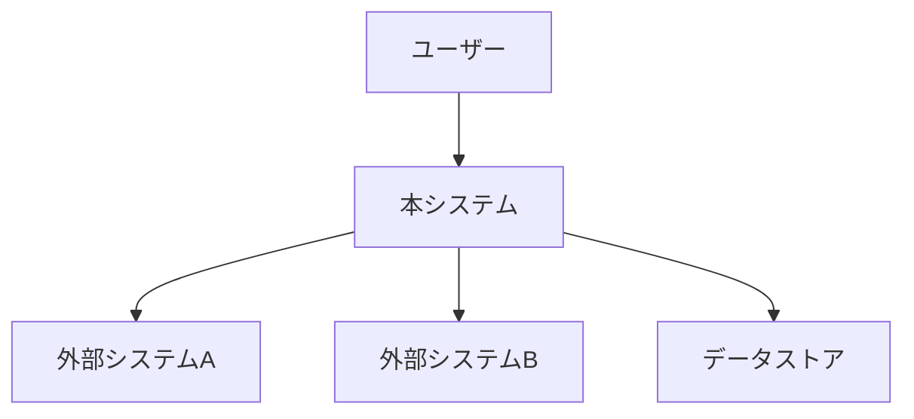

# {ソフトウェア名} - ソフトウェア要件仕様書（SRS）

> **バージョン**: 1.0

## 1. はじめに

### 1.1 目的

{この SRS の目的}

### 1.2 スコープ

{ソフトウェアの名称、目的、利点。何を含み何を含まないか}

### 1.3 用語定義

| 用語 | 定義 |
|:-----|:-----|
| {用語} | {定義} |

### 1.4 参考資料

- {関連ドキュメント、規格、外部リソース}

## 2. 全体概要

### 2.1 製品の視点

{このソフトウェアが既存システムやビジネスの中でどう位置づけられるか}

### 2.2 製品の機能概要

| ID | 機能 | 概要 |
|:---|:-----|:-----|
| F-001 | {機能名} | {概要} |

### 2.3 制約条件

- {設計・実装上の制約。技術スタック、規格、法規制、ハードウェア制限等}

### 2.4 前提条件と依存関係

- {開発における前提条件}

## 3. 機能要件

### FR-{NNN}: {機能要件名}

| 項目 | 内容 |
|:-----|:-----|
| ID | FR-{NNN} |
| 優先度 | P0 / P1 / P2 |
| 説明 | {機能の詳細説明} |
| 入力 | {入力データ・トリガー} |
| 処理 | {処理内容} |
| 出力 | {出力データ・結果} |
| 前提条件 | {この機能が動作するための前提} |
| 事後条件 | {この機能実行後の状態} |
| 受け入れ基準 | {検証可能な基準} |
| 検証方法 | テスト / レビュー / デモ / 分析 |

<!-- 機能要件の数だけ繰り返す -->

## 4. 外部インターフェース要件

### 4.1 ユーザーインターフェース

| 画面/操作 | 説明 | 制約 |
|:----------|:-----|:-----|
| {画面名} | {説明} | {制約} |

### 4.2 ハードウェアインターフェース

| デバイス | インターフェース | 説明 |
|:---------|:--------------|:-----|
| {デバイス} | {インターフェース} | {説明} |

### 4.3 ソフトウェアインターフェース

| 外部システム | プロトコル | データ形式 | 説明 |
|:------------|:---------|:----------|:-----|
| {システム名} | {REST/gRPC/MQTT等} | {JSON/XML等} | {説明} |

### 4.4 通信インターフェース

| 通信 | プロトコル | 暗号化 | 帯域要件 |
|:-----|:---------|:-------|:---------|
| {通信名} | {プロトコル} | {TLS等} | {要件} |

## 5. 非機能要件

### 5.1 パフォーマンス要件

| ID | 要件 | 目標値 | 計測方法 |
|:---|:-----|:-------|:---------|
| NF-P001 | レスポンスタイム | {値} | {方法} |
| NF-P002 | スループット | {値} | {方法} |
| NF-P003 | 同時接続数 | {値} | {方法} |

### 5.2 セキュリティ要件

| ID | 要件 | 詳細 |
|:---|:-----|:-----|
| NF-S001 | 認証 | {方式と詳細} |
| NF-S002 | 認可 | {権限モデル} |
| NF-S003 | データ暗号化 | {対象と方式} |
| NF-S004 | 監査ログ | {記録対象} |

### 5.3 信頼性・可用性要件

| ID | 要件 | 目標値 |
|:---|:-----|:-------|
| NF-R001 | 可用性 | {99.9%等} |
| NF-R002 | MTTR | {値} |
| NF-R003 | RPO | {値} |
| NF-R004 | RTO | {値} |

### 5.4 保守性・移植性要件

| ID | 要件 | 詳細 |
|:---|:-----|:-----|
| NF-M001 | コードカバレッジ | {目標値} |
| NF-M002 | 対応環境 | {OS、ブラウザ等} |
| NF-M003 | 国際化 | {対応言語} |

### 5.5 ユーザビリティ要件

| ID | 要件 | 基準 |
|:---|:-----|:-----|
| NF-U001 | アクセシビリティ | {WCAG 2.1 AA等} |
| NF-U002 | レスポンシブ対応 | {対応デバイス} |

