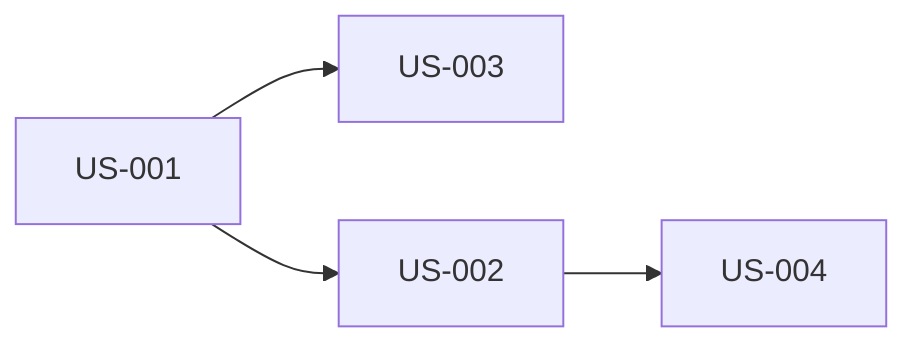

# {機能/プロダクト名} - ユーザーストーリーマップ

> **バージョン**: 1.0
> **作成日**: {YYYY-MM-DD}
> **作成者**: {作成者}
> **ステータス**: 下書き | レビュー中 | 承認済み

## 概要

{このストーリーマップが扱う機能/プロダクトの簡潔な説明}

## ペルソナ

| ペルソナ | 説明 | 主要ゴール |
|:---------|:-----|:----------|
| {ペルソナ名} | {どんな人か} | {何を達成したいか} |

## ストーリーマップ

### エピック: {エピック名}

```
┌─────────────────────────────────────────────────────────┐
│ ユーザーアクティビティ: {大きな活動}                        │
├───────────────┬───────────────┬───────────────────────────┤
│ タスク1        │ タスク2        │ タスク3                    │
├───────────────┼───────────────┼───────────────────────────┤
│ ストーリーA    │ ストーリーC    │ ストーリーE               │  ← MVP
│ ストーリーB    │ ストーリーD    │                           │  ← V2
└───────────────┴───────────────┴───────────────────────────┘
```

## ユーザーストーリー一覧

### {エピック名}

| ID | ストーリー | 優先度 | リリース |
|:---|:----------|:-------|:---------|
| US-001 | {ペルソナ}として、{行動}したい。{理由}のために。 | P0/P1/P2 | MVP/V2/V3 |

## 受入基準

### US-001: {ストーリータイトル}

**ストーリー**: {ペルソナ}として、{行動}したい。{理由}のために。

| # | GIVEN（前提） | WHEN（操作） | THEN（期待結果） |
|:--|:-------------|:------------|:----------------|
| 1 | {前提条件} | {ユーザーの操作} | {期待される結果} |
| 2 | {前提条件} | {ユーザーの操作} | {期待される結果} |

**エッジケース**:

| # | GIVEN（前提） | WHEN（操作） | THEN（期待結果） |
|:--|:-------------|:------------|:----------------|
| E1 | {異常系の前提条件} | {操作} | {期待される結果} |

<!-- ストーリーの数だけ繰り返す -->

## リリース計画

| リリース | ストーリー | 目標日 |
|:---------|:----------|:------|
| MVP | US-001, US-002, ... | {日付} |
| V2 | US-003, US-004, ... | {日付} |

## 依存関係



## 変更履歴

| バージョン | 日付 | 変更内容 | 変更者 |
|:-----------|:-----|:---------|:-------|
| 1.0 | {YYYY-MM-DD} | 初版作成 | {作成者} |
