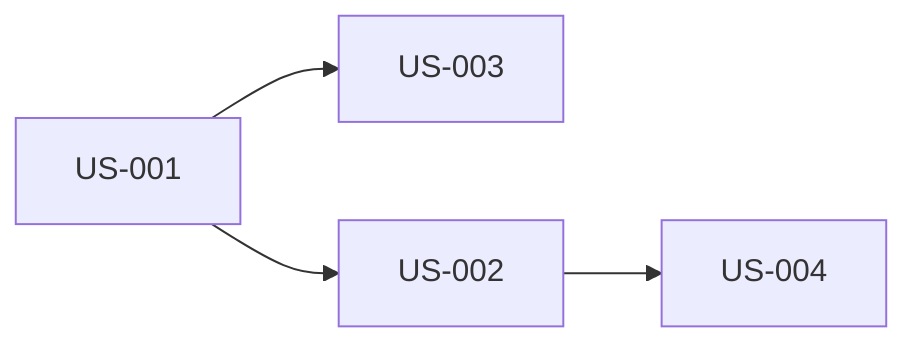

# {機能/プロダクト名} - ユーザーストーリーマップ

> **バージョン**: 1.0

## 概要

{このストーリーマップが扱う機能/プロダクトの簡潔な説明}

## ストーリーマップ

### エピック: {エピック名}

## ユーザーストーリー一覧

### {エピック名}

| ID | ストーリー | 優先度 |
|:---|:----------|:-------|
| US-001 | {ペルソナ}として、{行動}したい。{理由}のために。 | P0/P1/P2 |

## 受入基準

### US-001: {ストーリータイトル}

**ストーリー**: {ペルソナ}として、{行動}したい。{理由}のために。

| # | GIVEN（前提） | WHEN（操作） | THEN（期待結果） |
|:--|:-------------|:------------|:----------------|
| 1 | {前提条件} | {ユーザーの操作} | {期待される結果} |
| 2 | {前提条件} | {ユーザーの操作} | {期待される結果} |

**エッジケース**:

| # | GIVEN（前提） | WHEN（操作） | THEN（期待結果） |
|:--|:-------------|:------------|:----------------|
| E1 | {異常系の前提条件} | {操作} | {期待される結果} |

<!-- ストーリーの数だけ繰り返す -->

## 依存関係

