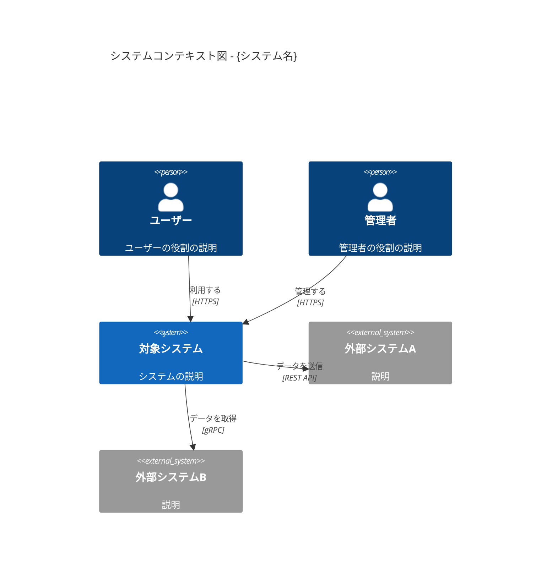
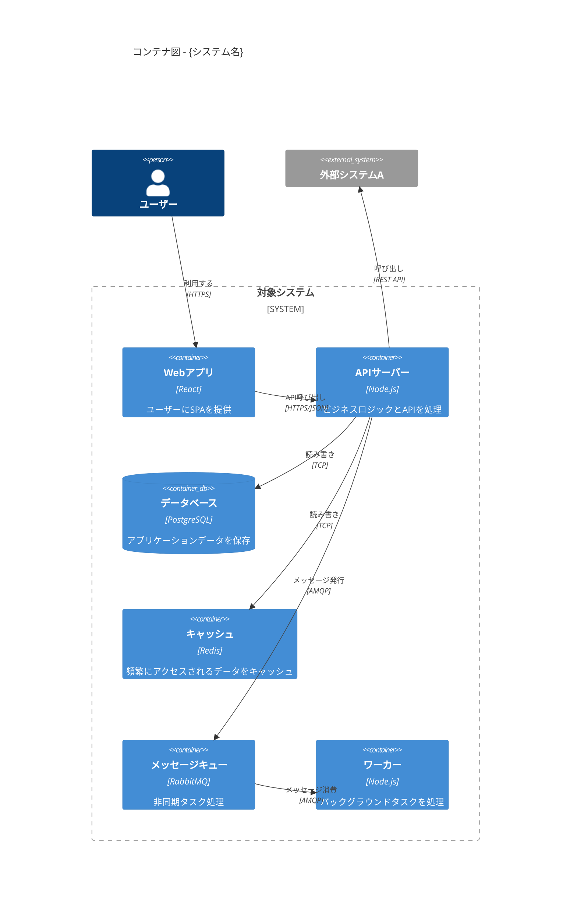
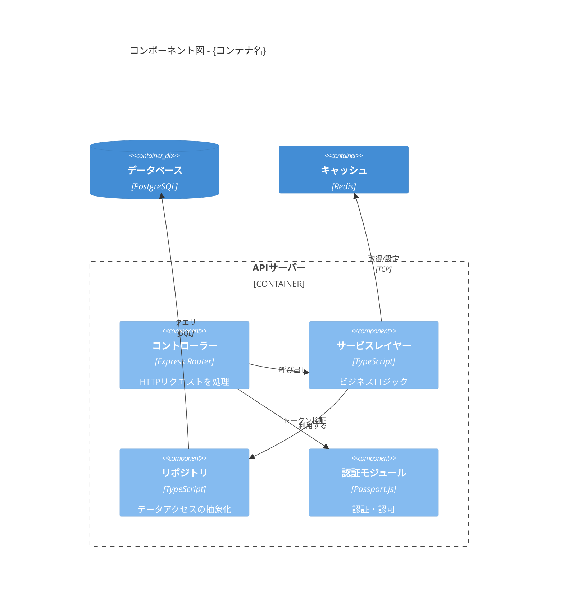

# {システム名} - C4モデル

> **バージョン**: 1.0
> **作成日**: {YYYY-MM-DD}
> **作成者**: {作成者}
> **ステータス**: 下書き | レビュー中 | 承認済み

## 概要

{システムの概要と、このC4モデルが何をドキュメント化するか}

---

## レベル1: システムコンテキスト図

対象システムとユーザー・外部システムとの関係を示す。

### コンテキストサマリー

| 要素 | 種別 | 説明 |
|:-----|:-----|:-----|
| {名前} | ユーザー / システム / 外部 | {説明} |

### 主要な関係

| 送信元 | 送信先 | 説明 | プロトコル |
|:-------|:-------|:-----|:----------|
| {送信元} | {送信先} | {データ/アクション} | {プロトコル} |

---

## レベル2: コンテナ図

システム内のコンテナ（アプリケーション、データストアなど）を示す。

### コンテナサマリー

| コンテナ | 技術 | 責務 |
|:---------|:-----|:-----|
| {名前} | {技術} | {何をするか} |

### 通信プロトコル

| 送信元 | 送信先 | プロトコル | 同期/非同期 | 備考 |
|:-------|:-------|:----------|:-----------|:-----|
| {送信元} | {送信先} | {プロトコル} | 同期/非同期 | {備考} |

---

## レベル3: コンポーネント図

特定のコンテナ内部のコンポーネントを示す。

### {コンテナ名} - コンポーネント

### コンポーネントサマリー

| コンポーネント | 技術 | 責務 | インターフェース |
|:-------------|:-----|:-----|:---------------|
| {名前} | {技術} | {何をするか} | {他からの利用方法} |

### 依存関係

| コンポーネント | 依存先 | 理由 |
|:-------------|:-------|:-----|
| {コンポーネント} | {依存先} | {理由} |

---

## 横断的関心事

### 認証・認可

| 観点 | アプローチ |
|:-----|:---------|
| 方式 | {例: JWT Bearerトークン} |
| 認可モデル | {例: RBAC} |
| トークンライフサイクル | {例: アクセス1時間 + リフレッシュ7日} |

### オブザーバビリティ

| 観点 | ツール | 詳細 |
|:-----|:-------|:-----|
| ログ | {ツール} | {アプローチ} |
| メトリクス | {ツール} | {主要な指標} |
| トレーシング | {ツール} | {アプローチ} |

### エラーハンドリング

| レイヤー | 戦略 |
|:--------|:-----|
| {レイヤー} | {エラーの処理方法} |

## 付録

### 用語集

| 用語 | 定義 |
|:-----|:-----|
| {用語} | {定義} |

### 変更履歴

| バージョン | 日付 | 変更内容 | 変更者 |
|:-----------|:-----|:---------|:-------|
| 1.0 | {YYYY-MM-DD} | 初版作成 | {作成者} |
