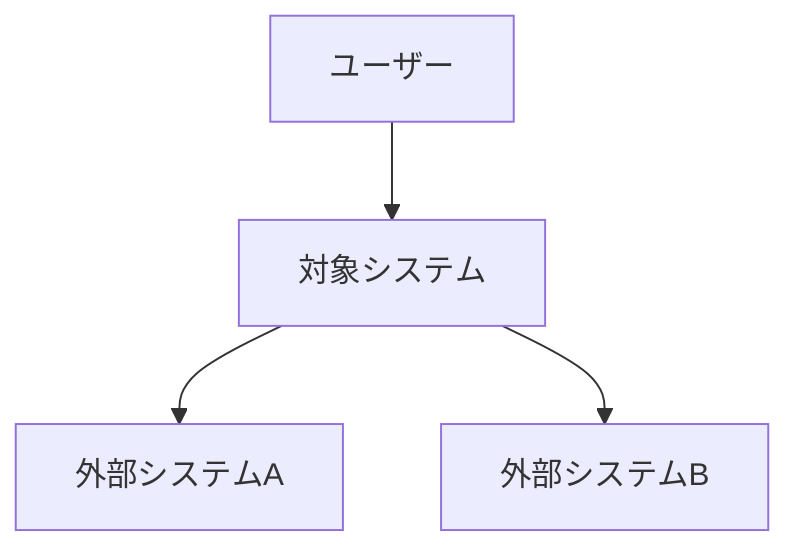
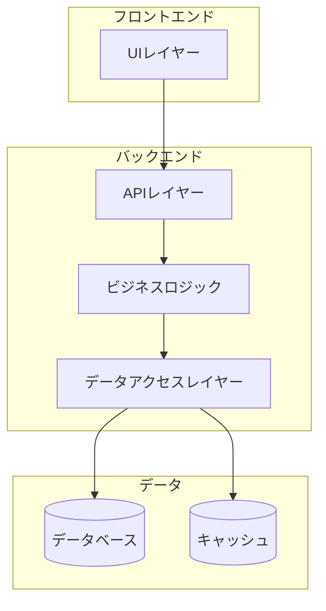
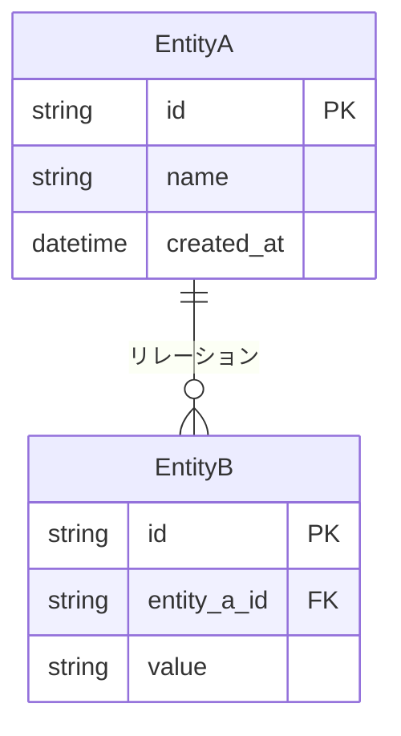
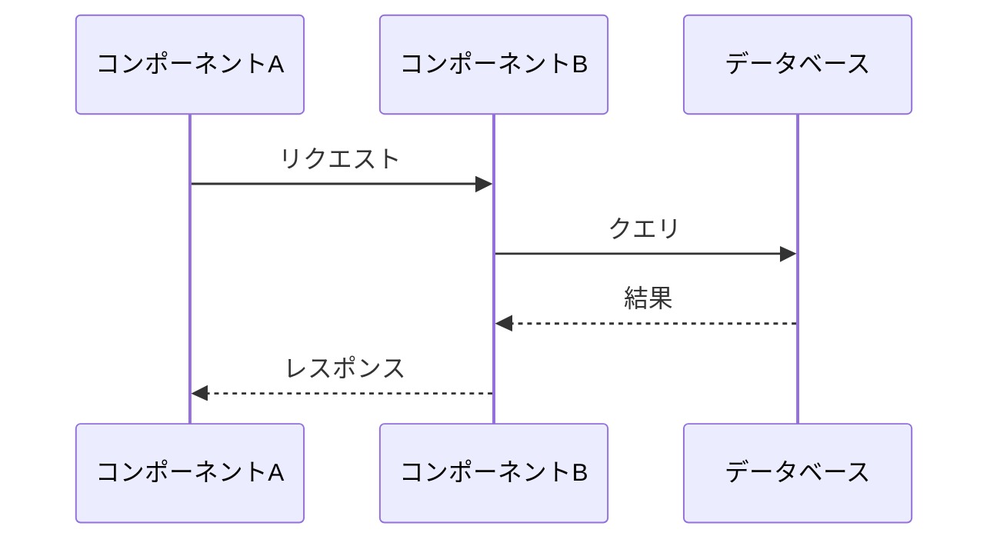
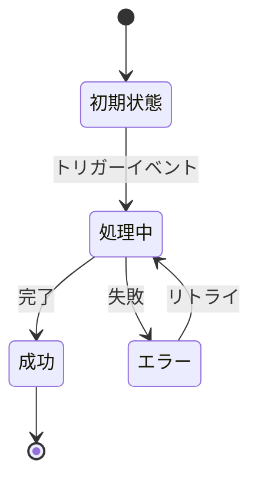
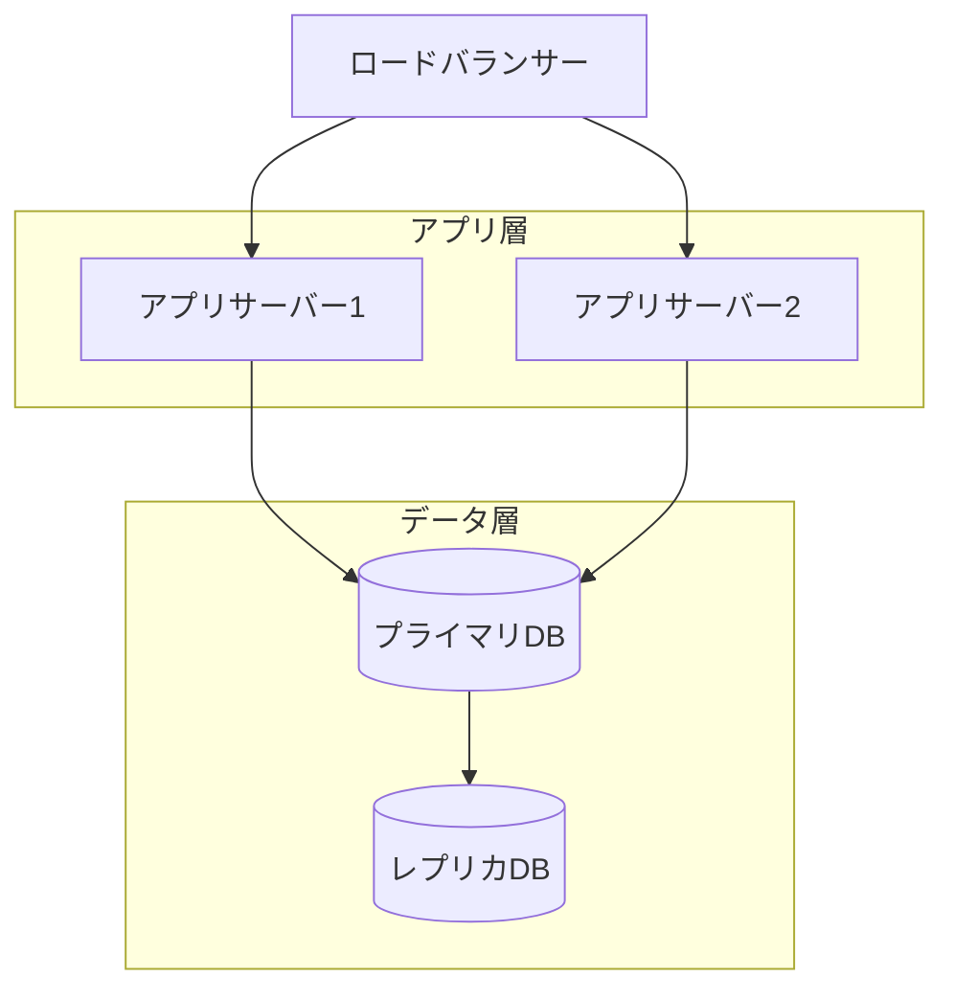

# {システム名} - システム設計書

> **バージョン**: 1.0
> **作成日**: {YYYY-MM-DD}
> **作成者**: {作成者}
> **ステータス**: 下書き | レビュー中 | 承認済み

## 1. 概要

### 1.1 目的

{このシステムが何をし、なぜ存在するか（2〜3文）}

### 1.2 目標と非目標

**目標**:
- {このシステムが達成しようとすること}

**非目標**:
- {このシステムが明示的に目指さないこと}

### 1.3 主要ステークホルダー

| 役割 | 名前 | 責務 |
|:-----|:-----|:-----|
| {役割} | {名前} | {責務} |

## 2. アーキテクチャ概要

### 2.1 システムコンテキスト

### 2.2 全体アーキテクチャ

### 2.3 技術スタック

| レイヤー | 技術 | 選定理由 |
|:---------|:-----|:---------|
| フロントエンド | {技術} | {理由} |
| バックエンド | {技術} | {理由} |
| データベース | {技術} | {理由} |
| インフラ | {技術} | {理由} |

## 3. コンポーネント設計

### 3.1 コンポーネント一覧

| コンポーネント | 責務 | インターフェース |
|:-------------|:-----|:---------------|
| {名前} | {何をするか} | {他からの利用方法} |

### 3.2 コンポーネント詳細

#### {コンポーネント名}

**責務**: {何をするか}

**インターフェース**:
| メソッド/エンドポイント | 入力 | 出力 | 説明 |
|:---------------------|:-----|:-----|:-----|
| {メソッド} | {入力} | {出力} | {説明} |

**内部ロジック**:
{主要なアルゴリズムやビジネスルール}

**依存関係**:
- {依存先とその理由}

## 4. データ設計

### 4.1 データモデル

### 4.2 データ辞書

| エンティティ | フィールド | 型 | 説明 | 制約 |
|:-----------|:---------|:---|:-----|:-----|
| {エンティティ} | {フィールド} | {型} | {説明} | {制約} |

### 4.3 データフロー

### 4.4 データ移行

| 移行元 | 移行先 | 戦略 | ロールバック |
|:-------|:-------|:-----|:-----------|
| {移行元} | {移行先} | {アプローチ} | {ロールバック方法} |

## 5. 状態管理

### 5.1 状態遷移図

### 5.2 状態遷移

| 遷移元 | 遷移先 | トリガー | 条件 | 副作用 |
|:-------|:-------|:--------|:-----|:-------|
| {遷移元} | {遷移先} | {トリガー} | {ガード条件} | {副作用} |

## 6. API設計

### 6.1 内部API

| メソッド | パス | 説明 | 利用者 |
|:---------|:-----|:-----|:-------|
| {メソッド} | {パス} | {説明} | {誰が呼ぶか} |

### 6.2 外部API（利用するもの）

| API | 目的 | SLA | フォールバック |
|:----|:-----|:----|:-------------|
| {API} | {利用目的} | {期待するSLA} | {ダウン時の対応} |

## 7. 非機能要件

### 7.1 パフォーマンス

| 指標 | 目標値 | 計測方法 |
|:-----|:-------|:---------|
| レスポンスタイム (P50) | {値} | {計測方法} |
| レスポンスタイム (P99) | {値} | {計測方法} |
| スループット | {値} | {計測方法} |

### 7.2 スケーラビリティ

| 軸 | 現状 | 目標 | 戦略 |
|:---|:-----|:-----|:-----|
| {例: ユーザー数} | {現状} | {目標} | {スケール方法} |

### 7.3 信頼性

| 指標 | 目標 | 戦略 |
|:-----|:-----|:-----|
| 可用性 | {例: 99.9%} | {アプローチ} |
| 復旧時間 (RTO) | {値} | {アプローチ} |
| 復旧ポイント (RPO) | {値} | {アプローチ} |

### 7.4 セキュリティ

| 観点 | 対策 |
|:-----|:-----|
| 認証 | {アプローチ} |
| 認可 | {アプローチ} |
| データ暗号化 | {アプローチ} |
| 入力バリデーション | {アプローチ} |

## 8. インフラ・デプロイ

### 8.1 インフラ構成図

### 8.2 デプロイ戦略

| 項目 | 値 |
|:-----|:---|
| 戦略 | {Blue-Green / カナリア / ローリング} |
| ロールバック方法 | {アプローチ} |
| ヘルスチェック | {エンドポイントと判定基準} |

### 8.3 モニタリング・アラート

| 指標 | 閾値 | 通知先 |
|:-----|:-----|:-------|
| {指標} | {閾値} | {通知先} |

## 9. リスク分析

| リスク | 影響度 | 発生確率 | 対策 |
|:-------|:-------|:---------|:-----|
| {リスク} | 高/中/低 | 高/中/低 | {対策} |

## 10. 検討した代替案

| 代替案 | メリット | デメリット | 判断 |
|:-------|:---------|:----------|:-----|
| {選択肢} | {メリット} | {デメリット} | 採用 / 不採用 |

## 付録

### 用語集

| 用語 | 定義 |
|:-----|:-----|
| {用語} | {定義} |

### 参考資料

- {関連ドキュメントやリソース}

### 変更履歴

| バージョン | 日付 | 変更内容 | 変更者 |
|:-----------|:-----|:---------|:-------|
| 1.0 | {YYYY-MM-DD} | 初版作成 | {作成者} |
